# APP_DOCUMENTATION

## Table of Contents
- [Phase 1: Repository Inventory](#phase-1-repository-inventory)
- [Phase 2: Per-Screen Documentation (mobile) and Per-Page Documentation (web)](#phase-2-per-screen-documentation-mobile-and-per-page-documentation-web)
- [Phase 3: Every Function](#phase-3-every-function)
- [Phase 4: Database & Backend](#phase-4-database--backend)
- [Phase 5: Auth & Role Model](#phase-5-auth--role-model)
- [Phase 6: Push Notifications, Realtime, and Background Behavior](#phase-6-push-notifications-realtime-and-background-behavior)
- [Phase 7: Cross-Cutting Feature Index](#phase-7-cross-cutting-feature-index)
- [Gaps & Inconsistencies](#gaps--inconsistencies)

## Phase 1: Repository Inventory

### Mobile App (`RepairShopApp/src`)
```
components/
  billing/
    BillingFormCards.tsx
  common/
    AppHeader.tsx
    AppPressable.tsx
    BottomSheet.tsx
    Button.tsx
    DetailRow.tsx
    EmptyState.tsx
    ErrorBoundary.tsx
    ErrorState.tsx
    LoadingState.tsx
    ModalShell.tsx
    ScreenScrollView.tsx
    SectionLabel.tsx
    SkeletonCard.tsx
    Toast.tsx
  inventory/
    InventoryFormSheet.tsx
    InventoryRow.tsx
  jobs/
    JobCard.tsx
    JobDetailShell.tsx
    JobList.tsx
    PriorityBadge.tsx
    StatusBadge.tsx
    TechnicianPicker.tsx
  materials/
    AddMaterialModal.tsx
    AllottedMaterialsCard.tsx
    MaterialCameraView.tsx
    MaterialList.tsx
  onsite/
  profile/
    PhotoPickerModal.tsx
    ProfileInfoCard.tsx
    ProfilePasswordCard.tsx
  salary/
    LeaveApplicationCard.tsx
    LeaveHistoryList.tsx
    SalaryAttendanceSummary.tsx
    SalaryBreakdownCard.tsx
    SalaryHeroCard.tsx
    SalaryHistoryList.tsx
    SalaryRatesCard.tsx
  sales/
    SaleCustomerForm.tsx
    SaleItemsList.tsx
    SalePaymentForm.tsx
    SaleSuccessCard.tsx
  shared/
    CreatableDropdown.tsx
    Dropdown.tsx
    LineItemTable.tsx
    RoleDashboard.tsx
    SegmentedControl.tsx
    SelfieCapture.tsx
  ui/
  work/
    CompletionSelfieBanner.tsx
    MaterialUsageModal.tsx
context/
  AppConfigContext.tsx
  AuthContext.tsx
  ToastContext.tsx
hooks/
  useBottomInsetPadding.ts
  useCameraPermission.ts
  useLocationPermission.ts
  usePushNotifications.ts
  useRealtimeSubscription.ts
lib/
  auth.ts
  invoiceService.ts
  shared/
    hooks/
  supabase.ts
navigation/
  AdminStack.tsx
  AdminTabs.tsx
  CustomTabBar.tsx
  navigationRef.ts
  ReceptionistJobsStack.tsx
  ReceptionistStack.tsx
  ReceptionistTabs.tsx
  RootNavigator.tsx
  TechnicianJobsStack.tsx
  TechnicianStack.tsx
  TechnicianTabs.tsx
screens/
  admin/
    AdminCreateStaffScreen.tsx
    AdminJobDetailScreen.tsx
    AdminJobsScreen.tsx
    ExpenditureScreen.tsx
    OverviewScreen.tsx
    ReportsScreen.tsx
    SalaryScreen.tsx
    StaffScreen.tsx
  auth/
    LoginScreen.tsx
  receptionist/
    AnalyticsScreen.tsx
    BillingScreen.tsx
    CustomerIntakeScreen.tsx
    CustomersScreen.tsx
    DashboardScreen.tsx
    JobAssignmentScreen.tsx
    JobDetailScreen.tsx
    JobListScreen.tsx
    NewSaleScreen.tsx
  shared/
    AllottedMaterialsScreen.tsx
    AttendanceScreen.tsx
    InactiveUserScreen.tsx
    InventoryScreen.tsx
    LoadingScreen.tsx
    NotificationsScreen.tsx
    ProfileScreen.tsx
    SalaryScreen.tsx
    SalesListScreen.tsx
  technician/
    AllottedMaterialsScreen.tsx
    MyJobsScreen.tsx
    OnsiteVisitScreen.tsx
    TechnicianDashboardScreen.tsx
    UpdateWorkScreen.tsx
tokens.ts
types/
  attendance.ts
  billing.ts
  job.ts
  onsiteVisit.ts
  user.ts
utils/
  compressImage.ts
  distance.ts
  errorMessages.ts
  playNotificationSound.ts
  storagePaths.ts

```

### Admin Web App (`admin-panel/src`)
```
app/
  (admin)/
    attendance/
      page.tsx
    expenditure/
      page.tsx
    inventory/
      page.tsx
    job-types/
      page.tsx
    jobs/
      new/
        page.tsx
        reducer.ts
      page.tsx
      [id]/
        page.tsx
        reducer.test.ts
        reducer.ts
    layout.tsx
    materials/
      page.tsx
    page.tsx
    pending-payments/
      page.tsx
    reports/
      page.tsx
    salary/
      page.tsx
    sales/
      new/
        page.tsx
        salesFlow.test.ts
      page.tsx
    settings/
      geofence/
        page.tsx
      page.tsx
      whatsapp/
        page.tsx
    staff/
      leaves/
        page.tsx
      page.tsx
  api/
    test/
      route.ts
  error.tsx
  favicon.ico
  global-error.tsx
  globals.css
  layout.tsx
  login/
    page.tsx
components/
  attendance/
    StaffAttendanceDrawer.tsx
  catalog/
    JobTypeFormModal.tsx
  common/
    Badge.tsx
    Button.tsx
    Card.tsx
    ConfirmationModal.tsx
    DataTable.tsx
    EmptyState.tsx
    ErrorState.tsx
    Input.tsx
    LoadingState.tsx
    Modal.tsx
    PageHeader.tsx
    Pagination.tsx
    PriorityBadge.tsx
    ProgressBar.tsx
    SearchFilterBar.tsx
    SectionCard.tsx
    Select.tsx
    Skeleton.tsx
    StatCard.tsx
    StatusBadge.tsx
    Tabs.tsx
    Textarea.tsx
    Toast.tsx
    ToastProvider.tsx
  dashboard/
    JobsPieChart.tsx
    RevenueChart.tsx
    TechPerformanceChart.tsx
  expenditure/
    ExpenditureForm.tsx
    ExpenditureSummaryCards.tsx
    ExpenditureTable.tsx
  inventory/
    AddStockModal.tsx
    InventoryFormModal.tsx
  jobs/
    detail/
      JobBillingCard.tsx
      JobConfigCard.tsx
      JobInfoCard.tsx
      JobMaterialsCard.tsx
      JobNotesCard.tsx
      OverviewTab.tsx
    new/
      AssignmentCard.tsx
      CustomerInfoCard.tsx
      DeviceIssueCard.tsx
      JobSuccessCard.tsx
      ServiceCatalogCard.tsx
    ReassignTechnicianModal.tsx
  layout/
    AdminLayout.tsx
    NotificationsDropdown.tsx
    Sidebar.tsx
    Topbar.tsx
  providers/
  salary/
    AdvanceSalaryForm.tsx
    BonusForm.tsx
    HolidayCalendarForm.tsx
    LeaveManagement.tsx
    SalaryBreakdownCard.tsx
    SalaryCalculatorForm.tsx
    StaffRateForm.tsx
  screens/
  settings/
    GeofenceMap.tsx
  staff/
    AddStaffModal.tsx
constants/
  colors.ts
context/
  AppConfigContext.tsx
  AuthContext.tsx
hooks/
  useCountUp.ts
lib/
  driveHelpers.ts
  edgeFunctions.test.ts
  invoiceClient.ts
  permissionMatrix.test.ts
  resendRateLimit.test.ts
  schemaValidation.test.ts
  supabase.ts
  tokens.ts
  utils.ts
styles/
  expenditure.module.css
  salary.module.css
types/
  inventory.ts
  salary.ts
  sales.ts
utils/
  csv.ts
  formatDate.ts
  materialsCsv.ts
  receiptHtml.ts
  salary.test.ts
  salary.ts
  salarySlipHtml.ts
  salesCsv.ts

```

### Supabase Backend (`supabase`)
```
.temp/
  cli-latest
  gotrue-version
  linked-project.json
  pooler-url
  postgres-version
  project-ref
  rest-version
  storage-migration
  storage-version
config.toml
db_structure.json
functions/
  admin-create-user/
    index.ts
  admin-delete-user/
    .npmrc
    deno.json
    index.ts
  calculate-monthly-salary/
    index.ts
  export-attendance-reports/
    index.ts
  export-monthly-data/
    index.ts
  generate-invoice/
    calc.ts
    companyConfig.ts
    index.ts
    svgAssets.ts
    svgTemplate.ts
  notify-on-inventory-change/
    index.ts
  notify-on-job-created/
    index.ts
  notify-on-late-checkin/
    index.ts
  notify-on-leave-event/
    index.ts
  notify-on-onsite-visit/
    index.ts
  notify-on-status-change/
    index.ts
  process-pending-uploads/
    index.ts
  send-invoice-email/
    index.ts
  test-drive-auth/
    index.ts
  upload-attendance-selfie/
    index.ts
  upload-avatar/
    index.ts
  upload-job-photo/
    index.ts
  upload-material-photo/
    index.ts
  _shared/
    attendanceReport.ts
    driveFolders.ts
    driveUpload.ts
    exportWorkbook.ts
    googleAuth.ts
    notifications.ts
live_schema.sql
migrations/
  20260819000000_baseline_schema.sql
  20260819175458_add_missing_inventory_rpc_columns.sql
  20260819180137_rename_selling_price_to_selling_rate.sql
  20260820000001_add_preview_invoice_and_amount_paid.sql
  _archive/
    20260721000000_rls_policies.sql
    20260721010000_sales.sql
    20260721011000_inventory_cost_price.sql
    20260722000000_salary_incentive_system.sql
    20260722000001_incentive_triggers.sql
    20260723000000_user_avatar_and_profile_rls.sql
    20260726000000_add_customer_gstin.sql
    20260727000000_remove_receptionist_incentive.sql
    20260727000001_redesign_salary_system.sql
    20260728000000_comprehensive_master_schema.sql
    20260728000001_fix_users_rls_recursion.sql
    20260728000002_add_created_at_to_notifications.sql
    20260728000003_create_storage_buckets.sql
    20260728000004_extend_attendance_columns.sql
    20260728000005_add_job_types_catalog_and_ref_id.sql
    20260728000006_fix_sales_schema_and_rpc.sql
    20260728000007_fix_onsite_visits_rls.sql
    20260728000008_allotted_materials_schema_and_rls.sql
    20260728000009_automatic_stock_deduction.sql
    20260801000001_add_missing_billing_columns.sql
    20260801000002_ui_lookup_tables.sql
    20260801000003_fix_sale_items_trigger.sql
    20260801000004_fix_device_type_check.sql
    20260801000005_payroll_rules_engine.sql
    20260801000006_simplify_payroll_schema.sql
    20260801000007_simplify_payroll_schema_final.sql
    20260801000008_feed_july_salary_arshad.sql
    20260801000009_salary_rls.sql
    20260802000000_add_low_accuracy_to_attendance.sql
    20260803000001_drive_export_infrastructure.sql
    20260803000002_google_drive_integration.sql
    20260804000002_react_doctor_security_fixes.sql
    20260812000001_phase1_sales_rls.sql
    20260812000002_phase2_multi_tech.sql
    20260813000001_phase3_geofence.sql
    20260813000002_phase3c_attendance_monitoring.sql
    20260814000001_fix_rls_auth_init_plan.sql
    20260814000002_fix_function_search_path.sql
    20260814000003_lock_down_security_definer_grants.sql
    20260814000004_add_missing_fk_indexes.sql
    20260814000005_drop_duplicate_and_unused_indexes.sql
    20260814000006_fix_extension_and_storage.sql
    20260816000000_allotted_materials_and_payments.sql
    20260816000001_c1_drop_misfiring_job_update_trigger.sql
    20260816000001_return_allotted_material.sql
    20260816000002_c2_rotate_webhook_secrets.sql
    20260816000003_c3_secure_remaining_webhooks.sql
    20260816000004_c4_fix_permissive_rls_policies.sql
    20260816000005_h2_add_missing_fk_indexes.sql
    20260816000006_h3_resolve_cascade_deletes.sql
    20260816000007_h4_drop_orphaned_legacy_functions.sql
    20260816000008_h5_consolidate_stock_deduction.sql
    20260816000009_h6_consolidate_incentive_logic.sql
    20260816000010_h7_payroll_audit_log_trigger.sql
    20260816000011_h8_drop_invoices_bucket.sql
    20260816000012_m1_drop_receptionist_job_incentive.sql
    20260816000013_m2_drop_computed_totals.sql
    20260816000014_m3_drop_avatars_bucket.sql
    20260816000015_m5_audit_security_definer_functions.sql
    20260816000016_c4_drop_leaky_inventory_policies.sql
    20260816000017_m4_standardize_remaining_rls_policies.sql
    20260816000018_m5_secure_return_allotted_material.sql
    20260818000001_phase4_serial_numbers.sql
    20260818000002_leave_notification_triggers.sql
    20260818000003_fix_create_invoice_serial_number.sql
MIGRATIONS_README.md

```

### Navigation Structure & Routing Config
**Mobile App (Expo/React Navigation)**
- `RootNavigator.tsx`: Handles auth state. Unauthenticated goes to `LoginScreen`. Authenticated goes to `AdminStack`, `ReceptionistStack`, or `TechnicianStack` based on user role.
- `AdminTabs.tsx`, `ReceptionistTabs.tsx`, `TechnicianTabs.tsx`: Tab navigators for each role.
- `AdminStack.tsx`, `ReceptionistStack.tsx`, `TechnicianStack.tsx`: Stack navigators for drill-down screens.

**Admin Web App (Next.js App Router)**
- `app/login/page.tsx`: Login page.
- `app/(admin)/layout.tsx`: Admin layout, likely containing navigation (Sidebar/Topbar) and role checks.
- `app/(admin)/*`: Various admin pages (attendance, jobs, sales, salary, inventory, reports, etc.).

## Phase 2: Per-Screen Documentation

### Mobile App Screens

### Screen: UpdateWorkScreen
- **File path**: `RepairShopApp\src\screens\technician\UpdateWorkScreen.tsx`
- **Allowed Roles**: technician
- **Purpose**: UI Screen displaying the MATERIALS / PARTS USED interface. Contains form inputs for data entry/updates. Directly interacts with Supabase to fetch or mutate data. 
- **Local State**: None
- **Data / Supabase Tables Used**: `job_materials`, `jobs`
- **UI Element Handlers Detected**:
  - `handleUpdate`

### Screen: TechnicianDashboardScreen
- **File path**: `RepairShopApp\src\screens\technician\TechnicianDashboardScreen.tsx`
- **Allowed Roles**: technician
- **Purpose**: UI Screen displaying the TechnicianDashboardScreen interface. Directly interacts with Supabase to fetch or mutate data. 
- **Local State**: `loading`, `logoutVisible`, `notificationsVisible`, `menuVisible`, `notificationsData`, `unreadCount`, `statsData`
- **Data / Supabase Tables Used**: `jobs`, `notifications`
- **UI Element Handlers Detected**:
  - `handleLogout`

### Screen: OnsiteVisitScreen
- **File path**: `RepairShopApp\src\screens\technician\OnsiteVisitScreen.tsx`
- **Allowed Roles**: technician
- **Purpose**: UI Screen displaying the START VISIT interface. Directly interacts with Supabase to fetch or mutate data. 
- **Local State**: `loading`, `error`, `job`, `visit`, `saving`
- **Data / Supabase Tables Used**: `onsite_visits`, `jobs`
- **UI Element Handlers Detected**:
  - `handleCaptureComplete`
  - `handleProceedToUpdate`

### Screen: MyJobsScreen
- **File path**: `RepairShopApp\src\screens\technician\MyJobsScreen.tsx`
- **Allowed Roles**: technician
- **Purpose**: UI Screen displaying the My Assigned Jobs interface. Directly interacts with Supabase to fetch or mutate data. 
- **Local State**: `loading`, `refreshing`, `loadingMore`, `page`, `hasMore`, `jobs`, `searchQuery`, `activeTab`, `unreadCount`, `counts`
- **Data / Supabase Tables Used**: `jobs`, `notifications`
- **UI Element Handlers Detected**:
  - `handleJobPress`

### Screen: AllottedMaterialsScreen
- **File path**: `RepairShopApp\src\screens\technician\AllottedMaterialsScreen.tsx`
- **Allowed Roles**: technician
- **Purpose**: UI Screen displaying the My Allotted Materials interface. Contains form inputs for data entry/updates. 
- **Local State**: `loading`, `error`, `allotments`, `refreshing`, `selectedAllotment`, `useQty`, `isUsing`
- **Data / Supabase Tables Used**: None
- **UI Element Handlers Detected**:
  - `handleUseOnJob`

### Screen: SalesListScreen
- **File path**: `RepairShopApp\src\screens\shared\SalesListScreen.tsx`
- **Allowed Roles**: shared across authenticated roles
- **Purpose**: UI Screen displaying the Sales interface. Renders a scrollable list of jobs or records for the shared across authenticated roles. 
- **Local State**: `loading`, `refreshing`, `items`
- **Data / Supabase Tables Used**: None

### Screen: SalaryScreen
- **File path**: `RepairShopApp\src\screens\shared\SalaryScreen.tsx`
- **Allowed Roles**: shared across authenticated roles
- **Purpose**: UI Screen displaying the My Salary interface. Contains form inputs for data entry/updates. Directly interacts with Supabase to fetch or mutate data. 
- **Local State**: `currentDate`, `record`, `myRates`, `loading`, `history`, `historyPage`, `historyTotal`, `histLoading`, `leaveDate`, `leaveReason`, `leaveSaving`, `myLeaves`, `leaveLoading`, `downloadingId`
- **Data / Supabase Tables Used**: `employee_leave`
- **UI Element Handlers Detected**:
  - `handleDownload`
  - `handleApplyLeave`

### Screen: ProfileScreen
- **File path**: `RepairShopApp\src\screens\shared\ProfileScreen.tsx`
- **Allowed Roles**: shared across authenticated roles
- **Purpose**: UI Screen displaying the Profile interface. Directly interacts with Supabase to fetch or mutate data. 
- **Local State**: None
- **Data / Supabase Tables Used**: `users`
- **UI Element Handlers Detected**:
  - `handleSavePhone`
  - `handleSaveEmail`
  - `handleChangePassword`
  - `handleSelectImage`

### Screen: NotificationsScreen
- **File path**: `RepairShopApp\src\screens\shared\NotificationsScreen.tsx`
- **Allowed Roles**: shared across authenticated roles
- **Purpose**: UI Screen displaying the Notifications interface. Directly interacts with Supabase to fetch or mutate data. 
- **Local State**: `loading`, `refreshing`, `loadingMore`, `notifications`, `activeTab`, `page`, `hasMore`, `counts`
- **Data / Supabase Tables Used**: `notifications`
- **UI Element Handlers Detected**:
  - `handleNotificationPress`
  - `handleTabChange`

### Screen: LoadingScreen
- **File path**: `RepairShopApp\src\screens\shared\LoadingScreen.tsx`
- **Allowed Roles**: shared across authenticated roles
- **Purpose**: UI Screen displaying the LoadingScreen interface. 
- **Local State**: None
- **Data / Supabase Tables Used**: None

### Screen: InventoryScreen
- **File path**: `RepairShopApp\src\screens\shared\InventoryScreen.tsx`
- **Allowed Roles**: shared across authenticated roles
- **Purpose**: UI Screen displaying the Inventory interface. Contains form inputs for data entry/updates. Directly interacts with Supabase to fetch or mutate data. 
- **Local State**: `loading`, `refreshing`, `loadingMore`, `items`, `searchQuery`, `isSearchFocused`, `activeTab`, `page`, `hasMore`, `modalVisible`, `editingItem`, `counts`, `itemName`, `quantity`, `costPrice`, `unit`, `threshold`, `saving`
- **Data / Supabase Tables Used**: `inventory`, `products`
- **UI Element Handlers Detected**:
  - `handleEdit`
  - `handleSave`
  - `handleDelete`

### Screen: InactiveUserScreen
- **File path**: `RepairShopApp\src\screens\shared\InactiveUserScreen.tsx`
- **Allowed Roles**: shared across authenticated roles
- **Purpose**: UI Screen displaying the InactiveUserScreen interface. 
- **Local State**: None
- **Data / Supabase Tables Used**: None
- **UI Element Handlers Detected**:
  - `handleLogout`

### Screen: AttendanceScreen
- **File path**: `RepairShopApp\src\screens\shared\AttendanceScreen.tsx`
- **Allowed Roles**: admin, receptionist, technician
- **Purpose**: UI Screen displaying the Attendance interface. Directly interacts with Supabase to fetch or mutate data. 
- **Local State**: `loading`, `refreshing`, `processing`, `todayRecord`, `history`, `historyLimit`, `dateOffset`, `geofenceSetting`, `modalVisible`, `selectedImage`, `confirmModalVisible`, `confirmAction`
- **Data / Supabase Tables Used**: `geofence_settings`, `attendance`
- **UI Element Handlers Detected**:
  - `handlePress`
  - `handleCaptureComplete`

### Screen: AllottedMaterialsScreen
- **File path**: `RepairShopApp\src\screens\shared\AllottedMaterialsScreen.tsx`
- **Allowed Roles**: shared across authenticated roles
- **Purpose**: UI Screen displaying the AllottedMaterialsScreen interface. Contains form inputs for data entry/updates. 
- **Local State**: `loading`, `refreshing`, `error`, `allotments`, `searchQuery`, `returningId`
- **Data / Supabase Tables Used**: None
- **UI Element Handlers Detected**:
  - `handleRefresh`
  - `handleMarkReturned`
  - `handleNotify`
  - `handlePressJob`

### Screen: NewSaleScreen
- **File path**: `RepairShopApp\src\screens\receptionist\NewSaleScreen.tsx`
- **Allowed Roles**: receptionist
- **Purpose**: UI Screen displaying the Sale Created interface. Directly interacts with Supabase to fetch or mutate data. 
- **Local State**: None
- **Data / Supabase Tables Used**: `sales`, `sale_items`
- **UI Element Handlers Detected**:
  - `handleWhatsAppInvoice`
  - `handlePrintInvoice`
  - `handleSubmit`

### Screen: JobListScreen
- **File path**: `RepairShopApp\src\screens\receptionist\JobListScreen.tsx`
- **Allowed Roles**: receptionist
- **Purpose**: UI Screen displaying the Jobs interface. Directly interacts with Supabase to fetch or mutate data. 
- **Local State**: `loading`, `refreshing`, `loadingMore`, `page`, `hasMore`, `jobs`, `searchQuery`, `activeTab`, `counts`
- **Data / Supabase Tables Used**: `jobs`

### Screen: JobDetailScreen
- **File path**: `RepairShopApp\src\screens\receptionist\JobDetailScreen.tsx`
- **Allowed Roles**: receptionist
- **Purpose**: UI Screen displaying the Job Details interface. Directly interacts with Supabase to fetch or mutate data. 
- **Local State**: `loading`, `error`, `job`, `materials`, `showTechPicker`, `feedbackMsg`
- **Data / Supabase Tables Used**: `job_technicians`
- **UI Element Handlers Detected**:
  - `handleReassign`
  - `handleWhatsApp`

### Screen: JobAssignmentScreen
- **File path**: `RepairShopApp\src\screens\receptionist\JobAssignmentScreen.tsx`
- **Allowed Roles**: receptionist
- **Purpose**: UI Screen displaying the Job Created interface. Directly interacts with Supabase to fetch or mutate data. 
- **Local State**: None
- **Data / Supabase Tables Used**: `jobs`, `job_technicians`
- **UI Element Handlers Detected**:
  - `handleWhatsAppInvoice`

### Screen: DashboardScreen
- **File path**: `RepairShopApp\src\screens\receptionist\DashboardScreen.tsx`
- **Allowed Roles**: receptionist
- **Purpose**: UI Screen displaying the DashboardScreen interface. Directly interacts with Supabase to fetch or mutate data. 
- **Local State**: `loading`, `logoutVisible`, `notificationsVisible`, `menuVisible`, `notificationsData`, `unreadCount`, `statsData`
- **Data / Supabase Tables Used**: `jobs`, `notifications`
- **UI Element Handlers Detected**:
  - `handleLogout`

### Screen: CustomersScreen
- **File path**: `RepairShopApp\src\screens\receptionist\CustomersScreen.tsx`
- **Allowed Roles**: receptionist
- **Purpose**: UI Screen displaying the Customers interface. Contains form inputs for data entry/updates. 
- **Local State**: `search`, `debouncedSearch`
- **Data / Supabase Tables Used**: None

### Screen: CustomerIntakeScreen
- **File path**: `RepairShopApp\src\screens\receptionist\CustomerIntakeScreen.tsx`
- **Allowed Roles**: receptionist
- **Purpose**: UI Screen displaying the New Job interface. Contains form inputs for data entry/updates. 
- **Local State**: `catalogItems`, `catalogLoading`, `deviceTypes`, `form`, `focusField`, `fieldErrors`
- **Data / Supabase Tables Used**: None
- **UI Element Handlers Detected**:
  - `handleSelectJobTypeCatalog`
  - `handleNext`

### Screen: BillingScreen
- **File path**: `RepairShopApp\src\screens\receptionist\BillingScreen.tsx`
- **Allowed Roles**: receptionist
- **Purpose**: UI Screen displaying the Billing interface. Directly interacts with Supabase to fetch or mutate data. 
- **Local State**: `loading`, `saving`, `error`, `job`, `materials`, `invoice`, `labourStr`, `taxStr`, `discountStr`, `isPaid`, `isNoCharge`
- **Data / Supabase Tables Used**: `invoices`
- **UI Element Handlers Detected**:
  - `handleSaveBill`
  - `handleWhatsApp`
  - `handleEmail`
  - `handlePrint`

### Screen: AnalyticsScreen
- **File path**: `RepairShopApp\src\screens\receptionist\AnalyticsScreen.tsx`
- **Allowed Roles**: receptionist
- **Purpose**: UI Screen displaying the Analytics interface. Directly interacts with Supabase to fetch or mutate data. 
- **Local State**: `loading`, `received`, `inProgress`, `completed`
- **Data / Supabase Tables Used**: `jobs`

### Screen: LoginScreen
- **File path**: `RepairShopApp\src\screens\auth\LoginScreen.tsx`
- **Allowed Roles**: unauthenticated (All)
- **Purpose**: Handles user authentication via Supabase and routes to the appropriate role-based dashboard upon success.
- **Local State**: None
- **Data / Supabase Tables Used**: None
- **UI Element Handlers Detected**:
  - `handleFocus`
  - `handleBlur`
  - `handleLogin`

### Screen: StaffScreen
- **File path**: `RepairShopApp\src\screens\admin\StaffScreen.tsx`
- **Allowed Roles**: admin
- **Purpose**: UI Screen displaying the Staff Management interface. 
- **Local State**: `loading`, `refreshing`, `loadingMore`, `page`, `hasMore`, `users`, `optionsVisible`, `selectedUser`, `toggling`, `attendanceVisible`, `attendanceLoading`, `attendanceRecords`
- **Data / Supabase Tables Used**: None
- **UI Element Handlers Detected**:
  - `handleOptions`

### Screen: SalaryScreen
- **File path**: `RepairShopApp\src\screens\admin\SalaryScreen.tsx`
- **Allowed Roles**: admin
- **Purpose**: UI Screen displaying the Salary Management interface. Directly interacts with Supabase to fetch or mutate data. 
- **Local State**: `month`, `monthPicker`, `staff`, `staffLoading`, `selectedUser`, `breakdown`, `calculating`, `detailVisible`, `saving`
- **Data / Supabase Tables Used**: `salary`

### Screen: ReportsScreen
- **File path**: `RepairShopApp\src\screens\admin\ReportsScreen.tsx`
- **Allowed Roles**: admin
- **Purpose**: UI Screen displaying the Reports interface. Directly interacts with Supabase to fetch or mutate data. 
- **Local State**: `loading`, `month`, `monthPicker`, `received`, `inProgress`, `completed`, `totalRevenue`, `techStats`
- **Data / Supabase Tables Used**: `users`

### Screen: OverviewScreen
- **File path**: `RepairShopApp\src\screens\admin\OverviewScreen.tsx`
- **Allowed Roles**: admin
- **Purpose**: UI Screen displaying the OverviewScreen interface. 
- **Local State**: `activeJobs`, `revenue`, `staffPresent`, `lowStockCount`, `urgentJobsCount`, `logoutVisible`, `menuVisible`, `notificationsVisible`, `notificationsData`, `unreadCount`
- **Data / Supabase Tables Used**: None

### Screen: ExpenditureScreen
- **File path**: `RepairShopApp\src\screens\admin\ExpenditureScreen.tsx`
- **Allowed Roles**: admin
- **Purpose**: UI Screen displaying the Expenditure interface. Contains form inputs for data entry/updates. Directly interacts with Supabase to fetch or mutate data. 
- **Local State**: `month`, `monthPicker`, `payments`, `loading`, `refreshing`, `addVisible`, `formType`, `formAmount`, `formDescription`, `typePicker`, `saving`
- **Data / Supabase Tables Used**: `payments`
- **UI Element Handlers Detected**:
  - `handleAddExpenditure`

### Screen: AdminJobsScreen
- **File path**: `RepairShopApp\src\screens\admin\AdminJobsScreen.tsx`
- **Allowed Roles**: admin
- **Purpose**: UI Screen displaying the All Jobs interface. Directly interacts with Supabase to fetch or mutate data. 
- **Local State**: `loading`, `refreshing`, `loadingMore`, `jobs`, `searchQuery`, `activeTab`, `page`, `hasMore`, `counts`
- **Data / Supabase Tables Used**: `jobs`
- **UI Element Handlers Detected**:
  - `handleTabChange`
  - `handleSearchChange`

### Screen: AdminJobDetailScreen
- **File path**: `RepairShopApp\src\screens\admin\AdminJobDetailScreen.tsx`
- **Allowed Roles**: admin
- **Purpose**: UI Screen displaying the Job Details interface. Directly interacts with Supabase to fetch or mutate data. 
- **Local State**: `loading`, `error`, `job`, `materials`, `showTechPicker`, `feedbackMsg`
- **Data / Supabase Tables Used**: `job_technicians`
- **UI Element Handlers Detected**:
  - `handleReassign`

### Screen: AdminCreateStaffScreen
- **File path**: `RepairShopApp\src\screens\admin\AdminCreateStaffScreen.tsx`
- **Allowed Roles**: admin
- **Purpose**: UI Screen displaying the Add Staff Member interface. Contains form inputs for data entry/updates. 
- **Local State**: None
- **Data / Supabase Tables Used**: None
- **UI Element Handlers Detected**:
  - `handleCreate`

### Web Admin App Screens / Pages

### Page: admin-panel\src\app\layout.tsx
- **File path**: `admin-panel\src\app\layout.tsx`
- **Allowed Roles**: admin
- **Purpose**: Web UI Page displaying the layout interface for Admin.
- **Data / Supabase Tables Used**: None

### Page: admin-panel\src\app\global-error.tsx
- **File path**: `admin-panel\src\app\global-error.tsx`
- **Allowed Roles**: admin
- **Purpose**: Web UI Page displaying the global-error interface for Admin.
- **Data / Supabase Tables Used**: None

### Page: admin-panel\src\app\error.tsx
- **File path**: `admin-panel\src\app\error.tsx`
- **Allowed Roles**: admin
- **Purpose**: Web UI Page displaying the error interface for Admin.
- **Data / Supabase Tables Used**: None

### Page: admin-panel\src\app\login\page.tsx
- **File path**: `admin-panel\src\app\login\page.tsx`
- **Allowed Roles**: admin
- **Purpose**: Web UI Page displaying the Digital Solution interface for Admin.
- **Data / Supabase Tables Used**: None
- **UI Element Handlers Detected**:
  - `handleLogin`

### Page: admin-panel\src\app\(admin)\page.tsx
- **File path**: `admin-panel\src\app\(admin)\page.tsx`
- **Allowed Roles**: admin
- **Purpose**: Web UI Page displaying the Overview interface for Admin.
- **Data / Supabase Tables Used**: None
- **UI Element Handlers Detected**:
  - `handleReturnMaterial`

### Page: admin-panel\src\app\(admin)\layout.tsx
- **File path**: `admin-panel\src\app\(admin)\layout.tsx`
- **Allowed Roles**: admin
- **Purpose**: Web UI Page displaying the layout interface for Admin.
- **Data / Supabase Tables Used**: None

### Page: admin-panel\src\app\(admin)\staff\page.tsx
- **File path**: `admin-panel\src\app\(admin)\staff\page.tsx`
- **Allowed Roles**: admin
- **Purpose**: Web UI Page displaying the page interface for Admin.
- **Data / Supabase Tables Used**: `users`
- **UI Element Handlers Detected**:
  - `handleApprove`
  - `handleBlock`
  - `handleDelete`

### Page: admin-panel\src\app\(admin)\staff\leaves\page.tsx
- **File path**: `admin-panel\src\app\(admin)\staff\leaves\page.tsx`
- **Allowed Roles**: admin
- **Purpose**: Web UI Page displaying the page interface for Admin.
- **Data / Supabase Tables Used**: `employee_leave`
- **UI Element Handlers Detected**:
  - `handleUpdateStatus`

### Page: admin-panel\src\app\(admin)\settings\page.tsx
- **File path**: `admin-panel\src\app\(admin)\settings\page.tsx`
- **Allowed Roles**: admin
- **Purpose**: Web UI Page displaying the page interface for Admin.
- **Data / Supabase Tables Used**: None
- **UI Element Handlers Detected**:
  - `handleSaveProfile`
  - `handleSaveShop`

### Page: admin-panel\src\app\(admin)\settings\whatsapp\page.tsx
- **File path**: `admin-panel\src\app\(admin)\settings\whatsapp\page.tsx`
- **Allowed Roles**: admin
- **Purpose**: Web UI Page displaying the page interface for Admin.
- **Data / Supabase Tables Used**: `whatsapp_settings`, `whatsapp_logs`
- **UI Element Handlers Detected**:
  - `handleTestMessage`

### Page: admin-panel\src\app\(admin)\settings\geofence\page.tsx
- **File path**: `admin-panel\src\app\(admin)\settings\geofence\page.tsx`
- **Allowed Roles**: admin
- **Purpose**: Web UI Page displaying the page interface for Admin.
- **Data / Supabase Tables Used**: None
- **UI Element Handlers Detected**:
  - `handleSave`
  - `handleSaveRadiusOnly`

### Page: admin-panel\src\app\(admin)\sales\page.tsx
- **File path**: `admin-panel\src\app\(admin)\sales\page.tsx`
- **Allowed Roles**: admin
- **Purpose**: Web UI Page displaying the page interface for Admin.
- **Data / Supabase Tables Used**: `invoices`
- **UI Element Handlers Detected**:
  - `handleClearFilters`

### Page: admin-panel\src\app\(admin)\sales\new\page.tsx
- **File path**: `admin-panel\src\app\(admin)\sales\new\page.tsx`
- **Allowed Roles**: admin
- **Purpose**: Web UI Page displaying the page interface for Admin.
- **Data / Supabase Tables Used**: `invoices`
- **UI Element Handlers Detected**:
  - `handleProductSelect`
  - `handleSubmit`

### Page: admin-panel\src\app\(admin)\salary\page.tsx
- **File path**: `admin-panel\src\app\(admin)\salary\page.tsx`
- **Allowed Roles**: admin
- **Purpose**: Web UI Page displaying the page interface for Admin.
- **Data / Supabase Tables Used**: `users`

### Page: admin-panel\src\app\(admin)\reports\page.tsx
- **File path**: `admin-panel\src\app\(admin)\reports\page.tsx`
- **Allowed Roles**: admin
- **Purpose**: Web UI Page displaying the page interface for Admin.
- **Data / Supabase Tables Used**: `export_jobs_latest`
- **UI Element Handlers Detected**:
  - `handleTriggerExport`
  - `handleExportCSV`

### Page: admin-panel\src\app\(admin)\pending-payments\page.tsx
- **File path**: `admin-panel\src\app\(admin)\pending-payments\page.tsx`
- **Allowed Roles**: admin
- **Purpose**: Web UI Page displaying the page interface for Admin.
- **Data / Supabase Tables Used**: None
- **UI Element Handlers Detected**:
  - `handleExportXLSX`

### Page: admin-panel\src\app\(admin)\materials\page.tsx
- **File path**: `admin-panel\src\app\(admin)\materials\page.tsx`
- **Allowed Roles**: admin
- **Purpose**: Web UI Page displaying the page interface for Admin.
- **Data / Supabase Tables Used**: None
- **UI Element Handlers Detected**:
  - `handleNotify`
  - `handleReturn`

### Page: admin-panel\src\app\(admin)\jobs\page.tsx
- **File path**: `admin-panel\src\app\(admin)\jobs\page.tsx`
- **Allowed Roles**: admin
- **Purpose**: Web UI Page displaying the page interface for Admin.
- **Data / Supabase Tables Used**: `jobs`
- **UI Element Handlers Detected**:
  - `handleExportCSV`
  - `handleClearFilters`

### Page: admin-panel\src\app\(admin)\jobs\[id]\page.tsx
- **File path**: `admin-panel\src\app\(admin)\jobs\[id]\page.tsx`
- **Allowed Roles**: admin
- **Purpose**: Web UI Page displaying the page interface for Admin.
- **Data / Supabase Tables Used**: `jobs`, `job_materials`, `invoices`, `users`
- **UI Element Handlers Detected**:
  - `handleSaveJob`

### Page: admin-panel\src\app\(admin)\jobs\new\page.tsx
- **File path**: `admin-panel\src\app\(admin)\jobs\new\page.tsx`
- **Allowed Roles**: admin
- **Purpose**: Web UI Page displaying the page interface for Admin.
- **Data / Supabase Tables Used**: `ui_device_types`, `jobs`, `job_technicians`
- **UI Element Handlers Detected**:
  - `handleSelectServiceCatalog`
  - `handleSubmit`
  - `handleChange`

### Page: admin-panel\src\app\(admin)\job-types\page.tsx
- **File path**: `admin-panel\src\app\(admin)\job-types\page.tsx`
- **Allowed Roles**: admin
- **Purpose**: Web UI Page displaying the page interface for Admin.
- **Data / Supabase Tables Used**: `job_types`
- **UI Element Handlers Detected**:
  - `handleToggleActive`
  - `handleDelete`

### Page: admin-panel\src\app\(admin)\inventory\page.tsx
- **File path**: `admin-panel\src\app\(admin)\inventory\page.tsx`
- **Allowed Roles**: admin
- **Purpose**: Web UI Page displaying the page interface for Admin.
- **Data / Supabase Tables Used**: `products`
- **UI Element Handlers Detected**:
  - `handleDelete`

### Page: admin-panel\src\app\(admin)\expenditure\page.tsx
- **File path**: `admin-panel\src\app\(admin)\expenditure\page.tsx`
- **Allowed Roles**: admin
- **Purpose**: Web UI Page displaying the page interface for Admin.
- **Data / Supabase Tables Used**: None
- **UI Element Handlers Detected**:
  - `handleExportXLSX`

### Page: admin-panel\src\app\(admin)\attendance\page.tsx
- **File path**: `admin-panel\src\app\(admin)\attendance\page.tsx`
- **Allowed Roles**: admin
- **Purpose**: Web UI Page displaying the page interface for Admin.
- **Data / Supabase Tables Used**: None
- **UI Element Handlers Detected**:
  - `handleReviewAction`
  - `handleExportAll`

## Phase 3: Core Business Logic & Exported Functions

> Exhaustive audit of all exported functions in utility, context, hook, and service files.

### File: `RepairShopApp\src\tokens.ts`
- **Function**: `export function getStatusCard(...)`
  - **Purpose**: Data fetching helper to query Supabase.
  - **Downstream Calls**: None directly observed

- **Function**: `export function getPriorityCard(...)`
  - **Purpose**: Data fetching helper to query Supabase.
  - **Downstream Calls**: None directly observed

### File: `RepairShopApp\src\utils\storagePaths.ts`
- **Function**: `export const getAttendanceStoragePath = (...) =>`
  - **Purpose**: Data fetching helper to query Supabase.
  - **Downstream Calls**: None directly observed

### File: `RepairShopApp\src\utils\playNotificationSound.ts`
- **Function**: `export function playNotificationSound(...)`
  - **Purpose**: Utility or hook providing encapsulated logic.
  - **Downstream Calls**: None directly observed

### File: `RepairShopApp\src\utils\errorMessages.ts`
- **Function**: `export function mapErrorToUserMessage(...)`
  - **Purpose**: Utility or hook providing encapsulated logic.
  - **Downstream Calls**: None directly observed

### File: `RepairShopApp\src\utils\distance.ts`
- **Function**: `export function getDistanceInMeters(...)`
  - **Purpose**: Data fetching helper to query Supabase.
  - **Downstream Calls**: None directly observed

### File: `RepairShopApp\src\utils\compressImage.ts`
- **Function**: `export function compressImage(...)`
  - **Purpose**: Utility or hook providing encapsulated logic.
  - **Downstream Calls**: None directly observed

### File: `RepairShopApp\src\lib\invoiceService.ts`
- **Function**: `export function printInvoice(...)`
  - **Purpose**: Utility or hook providing encapsulated logic.
  - **Downstream Calls**: None directly observed

- **Function**: `export function shareInvoice(...)`
  - **Purpose**: Utility or hook providing encapsulated logic.
  - **Downstream Calls**: None directly observed

### File: `RepairShopApp\src\hooks\useRealtimeSubscription.ts`
- **Function**: `export function useRealtimeSubscription(...)`
  - **Purpose**: Custom React hook providing state and/or Supabase integration to components.
  - **Downstream Calls**: None directly observed

### File: `RepairShopApp\src\hooks\useLocationPermission.ts`
- **Function**: `export const requirePermission = (...) =>`
  - **Purpose**: Utility or hook providing encapsulated logic.
  - **Downstream Calls**: None directly observed

- **Function**: `export const useLocationPermission = (...) =>`
  - **Purpose**: Custom React hook providing state and/or Supabase integration to components.
  - **Downstream Calls**: None directly observed

### File: `RepairShopApp\src\hooks\useCameraPermission.ts`
- **Function**: `export const useCameraPermission = (...) =>`
  - **Purpose**: Custom React hook providing state and/or Supabase integration to components.
  - **Downstream Calls**: None directly observed

### File: `RepairShopApp\src\hooks\useBottomInsetPadding.ts`
- **Function**: `export function useBottomInsetPadding(...)`
  - **Purpose**: Custom React hook providing state and/or Supabase integration to components.
  - **Downstream Calls**: None directly observed

### File: `RepairShopApp\src\context\ToastContext.tsx`
- **Function**: `export function ToastProvider(...)`
  - **Purpose**: React Context provider value/function for global state (e.g. AuthContext).
  - **Downstream Calls**: None directly observed

- **Function**: `export function useToast(...)`
  - **Purpose**: Custom React hook providing state and/or Supabase integration to components.
  - **Downstream Calls**: None directly observed

### File: `RepairShopApp\src\context\AuthContext.tsx`
- **Function**: `export const AuthProvider = (...) =>`
  - **Purpose**: React Context provider value/function for global state (e.g. AuthContext).
  - **Downstream Calls**: None directly observed

- **Function**: `export const useAuth = (...) =>`
  - **Purpose**: Custom React hook providing state and/or Supabase integration to components.
  - **Downstream Calls**: None directly observed

### File: `RepairShopApp\src\context\AppConfigContext.tsx`
- **Function**: `export function AppConfigProvider(...)`
  - **Purpose**: React Context provider value/function for global state (e.g. AuthContext).
  - **Downstream Calls**: None directly observed

- **Function**: `export function useAppConfig(...)`
  - **Purpose**: Custom React hook providing state and/or Supabase integration to components.
  - **Downstream Calls**: None directly observed

### File: `RepairShopApp\src\components\work\MaterialUsageModal.tsx`
- **Function**: `export function MaterialUsageModal(...)`
  - **Purpose**: Utility or hook providing encapsulated logic.
  - **Downstream Calls**: None directly observed

### File: `RepairShopApp\src\components\work\CompletionSelfieBanner.tsx`
- **Function**: `export function CompletionSelfieBanner(...)`
  - **Purpose**: Utility or hook providing encapsulated logic.
  - **Downstream Calls**: None directly observed

### File: `RepairShopApp\src\components\sales\SaleSuccessCard.tsx`
- **Function**: `export function SaleSuccessCard(...)`
  - **Purpose**: Utility or hook providing encapsulated logic.
  - **Downstream Calls**: None directly observed

### File: `RepairShopApp\src\components\sales\SalePaymentForm.tsx`
- **Function**: `export function SalePaymentForm(...)`
  - **Purpose**: Utility or hook providing encapsulated logic.
  - **Downstream Calls**: None directly observed

### File: `RepairShopApp\src\components\sales\SaleItemsList.tsx`
- **Function**: `export function SaleItemsList(...)`
  - **Purpose**: Utility or hook providing encapsulated logic.
  - **Downstream Calls**: None directly observed

### File: `RepairShopApp\src\components\sales\SaleCustomerForm.tsx`
- **Function**: `export function SaleCustomerForm(...)`
  - **Purpose**: Utility or hook providing encapsulated logic.
  - **Downstream Calls**: None directly observed

### File: `RepairShopApp\src\components\salary\SalaryRatesCard.tsx`
- **Function**: `export function SalaryRatesCard(...)`
  - **Purpose**: Utility or hook providing encapsulated logic.
  - **Downstream Calls**: None directly observed

### File: `RepairShopApp\src\components\salary\SalaryHistoryList.tsx`
- **Function**: `export function SalaryHistoryList(...)`
  - **Purpose**: Utility or hook providing encapsulated logic.
  - **Downstream Calls**: None directly observed

### File: `RepairShopApp\src\components\salary\SalaryHeroCard.tsx`
- **Function**: `export function SalaryHeroCard(...)`
  - **Purpose**: Utility or hook providing encapsulated logic.
  - **Downstream Calls**: None directly observed

### File: `RepairShopApp\src\components\salary\SalaryBreakdownCard.tsx`
- **Function**: `export function SalaryBreakdownCard(...)`
  - **Purpose**: Utility or hook providing encapsulated logic.
  - **Downstream Calls**: None directly observed

### File: `RepairShopApp\src\components\salary\SalaryAttendanceSummary.tsx`
- **Function**: `export function SalaryAttendanceSummary(...)`
  - **Purpose**: Utility or hook providing encapsulated logic.
  - **Downstream Calls**: None directly observed

### File: `RepairShopApp\src\components\salary\LeaveHistoryList.tsx`
- **Function**: `export function LeaveHistoryList(...)`
  - **Purpose**: Utility or hook providing encapsulated logic.
  - **Downstream Calls**: None directly observed

### File: `RepairShopApp\src\components\salary\LeaveApplicationCard.tsx`
- **Function**: `export function LeaveApplicationCard(...)`
  - **Purpose**: Utility or hook providing encapsulated logic.
  - **Downstream Calls**: None directly observed

### File: `RepairShopApp\src\components\profile\ProfilePasswordCard.tsx`
- **Function**: `export function ProfilePasswordCard(...)`
  - **Purpose**: Utility or hook providing encapsulated logic.
  - **Downstream Calls**: None directly observed

### File: `RepairShopApp\src\components\profile\ProfileInfoCard.tsx`
- **Function**: `export function ProfileInfoCard(...)`
  - **Purpose**: Utility or hook providing encapsulated logic.
  - **Downstream Calls**: None directly observed

### File: `RepairShopApp\src\components\profile\PhotoPickerModal.tsx`
- **Function**: `export function PhotoPickerModal(...)`
  - **Purpose**: Utility or hook providing encapsulated logic.
  - **Downstream Calls**: None directly observed

### File: `RepairShopApp\src\components\materials\MaterialCameraView.tsx`
- **Function**: `export function MaterialCameraView(...)`
  - **Purpose**: Utility or hook providing encapsulated logic.
  - **Downstream Calls**: None directly observed

### File: `RepairShopApp\src\components\inventory\InventoryFormSheet.tsx`
- **Function**: `export function InventoryFormSheet(...)`
  - **Purpose**: Utility or hook providing encapsulated logic.
  - **Downstream Calls**: None directly observed

### File: `RepairShopApp\src\components\common\Toast.tsx`
- **Function**: `export function Toast(...)`
  - **Purpose**: Utility or hook providing encapsulated logic.
  - **Downstream Calls**: None directly observed

### File: `RepairShopApp\src\components\common\SkeletonCard.tsx`
- **Function**: `export function SkeletonList(...)`
  - **Purpose**: Utility or hook providing encapsulated logic.
  - **Downstream Calls**: None directly observed

### File: `RepairShopApp\src\components\common\AppPressable.tsx`
- **Function**: `export function AppPressable(...)`
  - **Purpose**: Utility or hook providing encapsulated logic.
  - **Downstream Calls**: None directly observed

### File: `RepairShopApp\src\components\billing\BillingFormCards.tsx`
- **Function**: `export function BillingAdjustmentsForm(...)`
  - **Purpose**: Utility or hook providing encapsulated logic.
  - **Downstream Calls**: None directly observed

- **Function**: `export function BillingTotalsCard(...)`
  - **Purpose**: Utility or hook providing encapsulated logic.
  - **Downstream Calls**: None directly observed

### File: `admin-panel\src\utils\salesCsv.ts`
- **Function**: `export const exportSalesToCSV = (...) =>`
  - **Purpose**: Utility or hook providing encapsulated logic.
  - **Downstream Calls**: None directly observed

### File: `admin-panel\src\utils\salarySlipHtml.ts`
- **Function**: `export function generateSalarySlipHtml(...)`
  - **Purpose**: Utility or hook providing encapsulated logic.
  - **Downstream Calls**: None directly observed

### File: `admin-panel\src\utils\salary.ts`
- **Function**: `export function calculateNetSalary(...)`
  - **Purpose**: Utility or hook providing encapsulated logic.
  - **Downstream Calls**: None directly observed

### File: `admin-panel\src\utils\receiptHtml.ts`
- **Function**: `export function generateAdvanceReceiptHtml(...)`
  - **Purpose**: Utility or hook providing encapsulated logic.
  - **Downstream Calls**: None directly observed

### File: `admin-panel\src\utils\materialsCsv.ts`
- **Function**: `export const exportMaterialsToCSV = (...) =>`
  - **Purpose**: Utility or hook providing encapsulated logic.
  - **Downstream Calls**: None directly observed

### File: `admin-panel\src\utils\formatDate.ts`
- **Function**: `export function formatDate(...)`
  - **Purpose**: Utility or hook providing encapsulated logic.
  - **Downstream Calls**: None directly observed

- **Function**: `export function formatMonthLabel(...)`
  - **Purpose**: Utility or hook providing encapsulated logic.
  - **Downstream Calls**: None directly observed

- **Function**: `export function getCurrentMonth(...)`
  - **Purpose**: Data fetching helper to query Supabase.
  - **Downstream Calls**: None directly observed

### File: `admin-panel\src\utils\csv.ts`
- **Function**: `export const exportJobsToCSV = (...) =>`
  - **Purpose**: Utility or hook providing encapsulated logic.
  - **Downstream Calls**: None directly observed

- **Function**: `export const exportAttendanceToCSV = (...) =>`
  - **Purpose**: Utility or hook providing encapsulated logic.
  - **Downstream Calls**: None directly observed

### File: `admin-panel\src\lib\utils.ts`
- **Function**: `export function cn(...)`
  - **Purpose**: Utility or hook providing encapsulated logic.
  - **Downstream Calls**: None directly observed

### File: `admin-panel\src\lib\invoiceClient.ts`
- **Function**: `export function openInvoicePrint(...)`
  - **Purpose**: Utility or hook providing encapsulated logic.
  - **Downstream Calls**: None directly observed

- **Function**: `export function downloadInvoiceHtml(...)`
  - **Purpose**: Utility or hook providing encapsulated logic.
  - **Downstream Calls**: None directly observed

### File: `admin-panel\src\lib\driveHelpers.ts`
- **Function**: `export function getDriveImageUrl(...)`
  - **Purpose**: Data fetching helper to query Supabase.
  - **Downstream Calls**: None directly observed

### File: `admin-panel\src\hooks\useCountUp.ts`
- **Function**: `export function useCountUp(...)`
  - **Purpose**: Custom React hook providing state and/or Supabase integration to components.
  - **Downstream Calls**: None directly observed

### File: `admin-panel\src\app\api\test\route.ts`
- **Function**: `export function GET(...)`
  - **Purpose**: Utility or hook providing encapsulated logic.
  - **Downstream Calls**: None directly observed

### File: `admin-panel\src\app\(admin)\jobs\[id]\reducer.ts`
- **Function**: `export function jobDetailReducer(...)`
  - **Purpose**: Utility or hook providing encapsulated logic.
  - **Downstream Calls**: None directly observed

### File: `admin-panel\src\app\(admin)\jobs\new\reducer.ts`
- **Function**: `export function createJobReducer(...)`
  - **Purpose**: Data mutation helper writing to Supabase.
  - **Downstream Calls**: None directly observed

### File: `admin-panel\src\context\AuthContext.tsx`
- **Function**: `export function AuthProvider(...)`
  - **Purpose**: React Context provider value/function for global state (e.g. AuthContext).
  - **Downstream Calls**: None directly observed

- **Function**: `export const useAuth = (...) =>`
  - **Purpose**: Custom React hook providing state and/or Supabase integration to components.
  - **Downstream Calls**: None directly observed

### File: `admin-panel\src\context\AppConfigContext.tsx`
- **Function**: `export function AppConfigProvider(...)`
  - **Purpose**: React Context provider value/function for global state (e.g. AuthContext).
  - **Downstream Calls**: None directly observed

- **Function**: `export function useAppConfig(...)`
  - **Purpose**: Custom React hook providing state and/or Supabase integration to components.
  - **Downstream Calls**: None directly observed

### File: `admin-panel\src\components\staff\AddStaffModal.tsx`
- **Function**: `export function AddStaffModal(...)`
  - **Purpose**: Utility or hook providing encapsulated logic.
  - **Downstream Calls**: None directly observed

### File: `admin-panel\src\components\layout\NotificationsDropdown.tsx`
- **Function**: `export function NotificationsDropdown(...)`
  - **Purpose**: Utility or hook providing encapsulated logic.
  - **Downstream Calls**: None directly observed

### File: `admin-panel\src\components\jobs\new\ServiceCatalogCard.tsx`
- **Function**: `export function ServiceCatalogCard(...)`
  - **Purpose**: Utility or hook providing encapsulated logic.
  - **Downstream Calls**: None directly observed

### File: `admin-panel\src\components\jobs\new\JobSuccessCard.tsx`
- **Function**: `export function JobSuccessCard(...)`
  - **Purpose**: Utility or hook providing encapsulated logic.
  - **Downstream Calls**: None directly observed

### File: `admin-panel\src\components\jobs\new\DeviceIssueCard.tsx`
- **Function**: `export function DeviceIssueCard(...)`
  - **Purpose**: Utility or hook providing encapsulated logic.
  - **Downstream Calls**: None directly observed

### File: `admin-panel\src\components\jobs\new\CustomerInfoCard.tsx`
- **Function**: `export function CustomerInfoCard(...)`
  - **Purpose**: Utility or hook providing encapsulated logic.
  - **Downstream Calls**: None directly observed

### File: `admin-panel\src\components\jobs\new\AssignmentCard.tsx`
- **Function**: `export function AssignmentCard(...)`
  - **Purpose**: Utility or hook providing encapsulated logic.
  - **Downstream Calls**: None directly observed

### File: `admin-panel\src\components\jobs\detail\OverviewTab.tsx`
- **Function**: `export function OverviewTab(...)`
  - **Purpose**: Utility or hook providing encapsulated logic.
  - **Downstream Calls**: None directly observed

### File: `admin-panel\src\components\jobs\detail\JobNotesCard.tsx`
- **Function**: `export function JobNotesCard(...)`
  - **Purpose**: Utility or hook providing encapsulated logic.
  - **Downstream Calls**: None directly observed

### File: `admin-panel\src\components\jobs\detail\JobMaterialsCard.tsx`
- **Function**: `export function JobMaterialsCard(...)`
  - **Purpose**: Utility or hook providing encapsulated logic.
  - **Downstream Calls**: None directly observed

### File: `admin-panel\src\components\jobs\detail\JobInfoCard.tsx`
- **Function**: `export function JobInfoCard(...)`
  - **Purpose**: Utility or hook providing encapsulated logic.
  - **Downstream Calls**: None directly observed

### File: `admin-panel\src\components\jobs\detail\JobConfigCard.tsx`
- **Function**: `export function JobConfigCard(...)`
  - **Purpose**: Utility or hook providing encapsulated logic.
  - **Downstream Calls**: None directly observed

### File: `admin-panel\src\components\jobs\detail\JobBillingCard.tsx`
- **Function**: `export function JobBillingCard(...)`
  - **Purpose**: Utility or hook providing encapsulated logic.
  - **Downstream Calls**: None directly observed

### File: `admin-panel\src\components\common\ToastProvider.tsx`
- **Function**: `export function ToastProvider(...)`
  - **Purpose**: Utility or hook providing encapsulated logic.
  - **Downstream Calls**: None directly observed

- **Function**: `export function useToast(...)`
  - **Purpose**: Custom React hook providing state and/or Supabase integration to components.
  - **Downstream Calls**: None directly observed

### File: `admin-panel\src\components\common\Toast.tsx`
- **Function**: `export function Toast(...)`
  - **Purpose**: Utility or hook providing encapsulated logic.
  - **Downstream Calls**: None directly observed

### File: `admin-panel\src\components\common\Tabs.tsx`
- **Function**: `export function Tabs(...)`
  - **Purpose**: Utility or hook providing encapsulated logic.
  - **Downstream Calls**: None directly observed

### File: `admin-panel\src\components\common\StatusBadge.tsx`
- **Function**: `export function StatusBadge(...)`
  - **Purpose**: Utility or hook providing encapsulated logic.
  - **Downstream Calls**: None directly observed

### File: `admin-panel\src\components\common\StatCard.tsx`
- **Function**: `export function StatCard(...)`
  - **Purpose**: Utility or hook providing encapsulated logic.
  - **Downstream Calls**: None directly observed

### File: `admin-panel\src\components\common\Skeleton.tsx`
- **Function**: `export function Skeleton(...)`
  - **Purpose**: Utility or hook providing encapsulated logic.
  - **Downstream Calls**: None directly observed

- **Function**: `export function StatCardSkeleton(...)`
  - **Purpose**: Utility or hook providing encapsulated logic.
  - **Downstream Calls**: None directly observed

- **Function**: `export function StatCardGridSkeleton(...)`
  - **Purpose**: Utility or hook providing encapsulated logic.
  - **Downstream Calls**: None directly observed

- **Function**: `export function PageHeaderSkeleton(...)`
  - **Purpose**: Utility or hook providing encapsulated logic.
  - **Downstream Calls**: None directly observed

- **Function**: `export function SectionCardSkeleton(...)`
  - **Purpose**: Utility or hook providing encapsulated logic.
  - **Downstream Calls**: None directly observed

- **Function**: `export function DataTableSkeleton(...)`
  - **Purpose**: Utility or hook providing encapsulated logic.
  - **Downstream Calls**: None directly observed

- **Function**: `export function JobDetailSkeleton(...)`
  - **Purpose**: Utility or hook providing encapsulated logic.
  - **Downstream Calls**: None directly observed

### File: `admin-panel\src\components\common\SectionCard.tsx`
- **Function**: `export function SectionCard(...)`
  - **Purpose**: Utility or hook providing encapsulated logic.
  - **Downstream Calls**: None directly observed

### File: `admin-panel\src\components\common\SearchFilterBar.tsx`
- **Function**: `export function SearchFilterBar(...)`
  - **Purpose**: Utility or hook providing encapsulated logic.
  - **Downstream Calls**: None directly observed

### File: `admin-panel\src\components\common\ProgressBar.tsx`
- **Function**: `export function ProgressBar(...)`
  - **Purpose**: Utility or hook providing encapsulated logic.
  - **Downstream Calls**: None directly observed

### File: `admin-panel\src\components\common\PriorityBadge.tsx`
- **Function**: `export function PriorityBadge(...)`
  - **Purpose**: Utility or hook providing encapsulated logic.
  - **Downstream Calls**: None directly observed

### File: `admin-panel\src\components\common\Pagination.tsx`
- **Function**: `export function Pagination(...)`
  - **Purpose**: Utility or hook providing encapsulated logic.
  - **Downstream Calls**: None directly observed

### File: `admin-panel\src\components\common\PageHeader.tsx`
- **Function**: `export function PageHeader(...)`
  - **Purpose**: Utility or hook providing encapsulated logic.
  - **Downstream Calls**: None directly observed

### File: `admin-panel\src\components\common\Modal.tsx`
- **Function**: `export function Modal(...)`
  - **Purpose**: Utility or hook providing encapsulated logic.
  - **Downstream Calls**: None directly observed

### File: `admin-panel\src\components\common\LoadingState.tsx`
- **Function**: `export function LoadingState(...)`
  - **Purpose**: Utility or hook providing encapsulated logic.
  - **Downstream Calls**: None directly observed

### File: `admin-panel\src\components\common\ErrorState.tsx`
- **Function**: `export function ErrorState(...)`
  - **Purpose**: Utility or hook providing encapsulated logic.
  - **Downstream Calls**: None directly observed

### File: `admin-panel\src\components\common\EmptyState.tsx`
- **Function**: `export function EmptyState(...)`
  - **Purpose**: Utility or hook providing encapsulated logic.
  - **Downstream Calls**: None directly observed

### File: `admin-panel\src\components\common\DataTable.tsx`
- **Function**: `export function DataTable(...)`
  - **Purpose**: Utility or hook providing encapsulated logic.
  - **Downstream Calls**: None directly observed

- **Function**: `export function TableHead(...)`
  - **Purpose**: Utility or hook providing encapsulated logic.
  - **Downstream Calls**: None directly observed

- **Function**: `export function TableBody(...)`
  - **Purpose**: Utility or hook providing encapsulated logic.
  - **Downstream Calls**: None directly observed

- **Function**: `export function TableRow(...)`
  - **Purpose**: Utility or hook providing encapsulated logic.
  - **Downstream Calls**: None directly observed

- **Function**: `export function TableHeaderCell(...)`
  - **Purpose**: Utility or hook providing encapsulated logic.
  - **Downstream Calls**: None directly observed

- **Function**: `export function TableCell(...)`
  - **Purpose**: Utility or hook providing encapsulated logic.
  - **Downstream Calls**: None directly observed

### File: `admin-panel\src\components\common\ConfirmationModal.tsx`
- **Function**: `export function ConfirmationModal(...)`
  - **Purpose**: Utility or hook providing encapsulated logic.
  - **Downstream Calls**: None directly observed

### File: `admin-panel\src\components\common\Card.tsx`
- **Function**: `export function Card(...)`
  - **Purpose**: Utility or hook providing encapsulated logic.
  - **Downstream Calls**: None directly observed

- **Function**: `export function CardHeader(...)`
  - **Purpose**: Utility or hook providing encapsulated logic.
  - **Downstream Calls**: None directly observed

- **Function**: `export function CardTitle(...)`
  - **Purpose**: Utility or hook providing encapsulated logic.
  - **Downstream Calls**: None directly observed

- **Function**: `export function CardContent(...)`
  - **Purpose**: Utility or hook providing encapsulated logic.
  - **Downstream Calls**: None directly observed

### File: `admin-panel\src\components\common\Badge.tsx`
- **Function**: `export function Badge(...)`
  - **Purpose**: Utility or hook providing encapsulated logic.
  - **Downstream Calls**: None directly observed

### File: `admin-panel\src\components\attendance\StaffAttendanceDrawer.tsx`
- **Function**: `export function StaffAttendanceDrawer(...)`
  - **Purpose**: Utility or hook providing encapsulated logic.
  - **Downstream Calls**: None directly observed

## Phase 4: Database & Backend

> **Note:** This schema is extracted directly from the actual live database via `supabase gen types`.

### Tables & Columns
#### `attendance`
| Column | Type | Nullable |
|--------|------|----------|
| `approved_by` | `string` | true |
| `at_location` | `boolean` | true |
| `check_in_drive_file_id` | `string` | true |
| `check_in_time` | `string` | true |
| `check_out_drive_file_id` | `string` | true |
| `check_out_gps_lat` | `number` | true |
| `check_out_gps_lng` | `number` | true |
| `check_out_time` | `string` | true |
| `date` | `string` | false |
| `early_hours` | `number` | true |
| `early_in_minutes` | `number` | true |
| `gps_lat` | `number` | true |
| `gps_lng` | `number` | true |
| `id` | `string` | false |
| `late_in_minutes` | `number` | true |
| `late_out_minutes` | `number` | true |
| `low_accuracy` | `boolean` | true |
| `ot_hours` | `number` | true |
| `review_status` | `string` | true |
| `status` | `string` | true |
| `user_id` | `string` | true |

#### `billing_legacy`
| Column | Type | Nullable |
|--------|------|----------|
| `created_at` | `string` | true |
| `discount` | `number` | true |
| `grand_total` | `number` | true |
| `id` | `string` | false |
| `invoice_url` | `string` | true |
| `is_paid` | `boolean` | true |
| `job_id` | `string` | true |
| `labour_charge` | `number` | true |
| `parts_total` | `number` | true |
| `payment_mode` | `string` | true |
| `tax_percent` | `number` | true |

#### `customer_reviews`
| Column | Type | Nullable |
|--------|------|----------|
| `comments` | `string` | true |
| `created_at` | `string` | true |
| `id` | `string` | false |
| `job_id` | `string` | true |
| `score` | `number` | false |
| `user_id` | `string` | true |

#### `employee_bonus`
| Column | Type | Nullable |
|--------|------|----------|
| `amount` | `number` | false |
| `created_at` | `string` | true |
| `created_by` | `string` | true |
| `id` | `string` | false |
| `month` | `number` | false |
| `reason` | `string` | false |
| `user_id` | `string` | false |
| `year` | `number` | false |

#### `employee_leave`
| Column | Type | Nullable |
|--------|------|----------|
| `approved_by` | `string` | true |
| `created_at` | `string` | true |
| `id` | `string` | false |
| `leave_date` | `string` | false |
| `leave_type` | `string` | false |
| `reason` | `string` | true |
| `status` | `string` | false |
| `user_id` | `string` | false |

#### `export_jobs`
| Column | Type | Nullable |
|--------|------|----------|
| `completed_at` | `string` | true |
| `created_at` | `string` | false |
| `drive_file_id` | `string` | true |
| `drive_link` | `string` | true |
| `error_message` | `string` | true |
| `id` | `string` | false |
| `started_at` | `string` | false |
| `status` | `string` | false |
| `target_month` | `string` | true |
| `type` | `string` | false |

#### `geofence_settings`
| Column | Type | Nullable |
|--------|------|----------|
| `center_lat` | `number` | false |
| `center_lng` | `number` | false |
| `id` | `string` | false |
| `is_active` | `boolean` | true |
| `radius_meters` | `number` | false |
| `updated_at` | `string` | true |

#### `holidays`
| Column | Type | Nullable |
|--------|------|----------|
| `created_at` | `string` | true |
| `date` | `string` | false |
| `id` | `string` | false |
| `is_recurring` | `boolean` | true |
| `name` | `string` | false |

#### `inventory`
| Column | Type | Nullable |
|--------|------|----------|
| `cost_price` | `number` | true |
| `id` | `string` | false |
| `item_name` | `string` | false |
| `last_updated` | `string` | true |
| `location` | `string` | true |
| `low_stock_threshold` | `number` | true |
| `minimum_stock_level` | `number` | true |
| `product_id` | `string` | true |
| `purchase_rate` | `number` | true |
| `quantity` | `number` | true |
| `quantity_cached` | `number` | true |
| `selling_rate` | `number` | true |
| `unit` | `string` | true |

#### `inventory_audit_log`
| Column | Type | Nullable |
|--------|------|----------|
| `change_type` | `string` | true |
| `changed_at` | `string` | true |
| `changed_by` | `string` | true |
| `id` | `string` | false |
| `inventory_id` | `string` | true |
| `new_quantity` | `number` | true |
| `old_quantity` | `number` | true |

#### `inventory_transactions`
| Column | Type | Nullable |
|--------|------|----------|
| `created_at` | `string` | true |
| `created_by` | `string` | true |
| `id` | `string` | false |
| `inventory_id` | `string` | true |
| `quantity` | `number` | false |
| `reference_note` | `string` | true |
| `serial_numbers` | `string` | true |
| `transaction_type` | `string` | false |

#### `invoice_items`
| Column | Type | Nullable |
|--------|------|----------|
| `cgst_amount` | `number` | true |
| `cgst_rate` | `number` | true |
| `created_at` | `string` | true |
| `discount_amount` | `number` | true |
| `id` | `string` | false |
| `igst_amount` | `number` | true |
| `igst_rate` | `number` | true |
| `invoice_id` | `string` | false |
| `item_name` | `string` | false |
| `line_total` | `number` | true |
| `product_id` | `string` | true |
| `quantity` | `number` | false |
| `selling_rate` | `number` | false |
| `serial_number` | `string` | true |
| `sgst_amount` | `number` | true |
| `sgst_rate` | `number` | true |
| `taxable_amount` | `number` | true |

#### `invoices`
| Column | Type | Nullable |
|--------|------|----------|
| `amount_paid` | `number` | true |
| `created_at` | `string` | true |
| `created_by` | `string` | true |
| `customer_contact` | `string` | true |
| `customer_email` | `string` | true |
| `customer_gstin` | `string` | true |
| `customer_name` | `string` | false |
| `discount` | `number` | true |
| `grand_total` | `number` | true |
| `id` | `string` | false |
| `invoice_code` | `string` | false |
| `job_id` | `string` | true |
| `notes` | `string` | true |
| `paid_at` | `string` | true |
| `payment_method` | `string` | true |
| `round_off` | `number` | true |
| `status` | `string` | true |
| `subtotal` | `number` | true |
| `tax_regime` | `string` | true |
| `total_cgst` | `number` | true |
| `total_igst` | `number` | true |
| `total_sgst` | `number` | true |
| `total_tax` | `number` | true |

#### `job_materials`
| Column | Type | Nullable |
|--------|------|----------|
| `checkout_status` | `string` | false |
| `created_at` | `string` | true |
| `id` | `string` | false |
| `inventory_id` | `string` | true |
| `inventory_transaction_id` | `string` | true |
| `job_id` | `string` | true |
| `material_name` | `string` | false |
| `photo_drive_file_id` | `string` | true |
| `product_id` | `string` | true |
| `qty_taken` | `number` | true |
| `quantity` | `number` | false |
| `returned_at` | `string` | true |
| `status` | `string` | true |
| `technician_id` | `string` | true |
| `total_cost` | `number` | true |
| `unit_cost` | `number` | false |
| `usage_confirmed_at` | `string` | true |

#### `job_technicians`
| Column | Type | Nullable |
|--------|------|----------|
| `assigned_at` | `string` | false |
| `id` | `string` | false |
| `job_id` | `string` | false |
| `removed_at` | `string` | true |
| `technician_id` | `string` | false |

#### `job_types`
| Column | Type | Nullable |
|--------|------|----------|
| `created_at` | `string` | true |
| `customer_charge_amount` | `number` | false |
| `id` | `string` | false |
| `is_active` | `boolean` | false |
| `technician_incentive` | `number` | false |
| `title` | `string` | false |

#### `jobs`
| Column | Type | Nullable |
|--------|------|----------|
| `advance_amount` | `number` | true |
| `completed_at` | `string` | true |
| `created_at` | `string` | true |
| `customer_contact` | `string` | false |
| `customer_email` | `string` | true |
| `customer_gstin` | `string` | true |
| `customer_name` | `string` | false |
| `device_type_id` | `string` | true |
| `id` | `string` | false |
| `job_code` | `string` | false |
| `job_type` | `string` | true |
| `job_type_ref_id` | `string` | true |
| `priority` | `string` | true |
| `receptionist_id` | `string` | true |
| `remarks` | `string` | true |
| `reported_issue` | `string` | false |
| `snap_technician_incentive` | `number` | true |
| `status` | `string` | true |
| `status_changed_at` | `string` | true |
| `technician_id` | `string` | true |
| `work_notes` | `string` | true |

#### `material_allotments`
| Column | Type | Nullable |
|--------|------|----------|
| `allotted_at` | `string` | true |
| `allotted_by` | `string` | true |
| `id` | `string` | false |
| `inventory_id` | `string` | true |
| `job_id` | `string` | true |
| `quantity` | `number` | false |
| `returned_at` | `string` | true |
| `status` | `string` | true |

#### `notifications`
| Column | Type | Nullable |
|--------|------|----------|
| `channel` | `string` | false |
| `created_at` | `string` | true |
| `id` | `string` | false |
| `is_read` | `boolean` | true |
| `job_id` | `string` | true |
| `message` | `string` | false |
| `recipient_user_id` | `string` | true |
| `sent_at` | `string` | true |
| `status` | `string` | true |
| `title` | `string` | true |
| `type` | `string` | true |

#### `onsite_visits`
| Column | Type | Nullable |
|--------|------|----------|
| `arrival_drive_file_id` | `string` | true |
| `arrival_gps_lat` | `number` | true |
| `arrival_gps_lng` | `number` | true |
| `arrival_time` | `string` | true |
| `departure_drive_file_id` | `string` | true |
| `departure_gps_lat` | `number` | true |
| `departure_gps_lng` | `number` | true |
| `departure_time` | `string` | true |
| `id` | `string` | false |
| `job_id` | `string` | true |
| `technician_id` | `string` | true |

#### `payments`
| Column | Type | Nullable |
|--------|------|----------|
| `amount` | `number` | false |
| `created_at` | `string` | true |
| `created_by` | `string` | true |
| `description` | `string` | true |
| `id` | `string` | false |
| `type` | `string` | false |
| `user_id` | `string` | true |

#### `payroll_audit_log`
| Column | Type | Nullable |
|--------|------|----------|
| `action` | `string` | true |
| `changed_at` | `string` | true |
| `changed_by` | `string` | true |
| `id` | `string` | false |
| `new_snapshot` | `Json` | true |
| `old_snapshot` | `Json` | true |
| `salary_id` | `string` | true |
| `user_id` | `string` | true |

#### `pending_uploads`
| Column | Type | Nullable |
|--------|------|----------|
| `attempts` | `number` | false |
| `created_at` | `string` | false |
| `id` | `string` | false |
| `last_error` | `string` | true |
| `payload_json` | `Json` | false |
| `reference_id` | `string` | false |
| `reference_table` | `string` | false |
| `type` | `string` | false |

#### `products`
| Column | Type | Nullable |
|--------|------|----------|
| `brand` | `string` | true |
| `category` | `string` | true |
| `cgst_rate` | `number` | true |
| `created_at` | `string` | true |
| `created_by` | `string` | true |
| `description` | `string` | true |
| `hsn_sac` | `string` | true |
| `id` | `string` | false |
| `igst_rate` | `number` | true |
| `is_active` | `boolean` | true |
| `name` | `string` | false |
| `sgst_rate` | `number` | true |
| `sku` | `string` | true |
| `tax_mode` | `string` | true |
| `unit` | `string` | true |
| `updated_at` | `string` | true |

#### `salary`
| Column | Type | Nullable |
|--------|------|----------|
| `absence_deduction_total` | `number` | true |
| `advance_deducted` | `number` | true |
| `base_daily_rate` | `number` | true |
| `bonus_amount` | `number` | true |
| `created_at` | `string` | true |
| `customer_review_bonus_total` | `number` | true |
| `customer_review_deduction` | `number` | true |
| `early_deduction` | `number` | true |
| `early_deduction_per_hour` | `number` | true |
| `early_hours` | `number` | true |
| `early_in_bonus_total` | `number` | true |
| `early_out_deduction_total` | `number` | true |
| `generated_by` | `string` | true |
| `gross_salary` | `number` | true |
| `halfday_count` | `number` | true |
| `halfday_deduction_total` | `number` | true |
| `id` | `string` | false |
| `incentive_amount` | `number` | true |
| `job_completion_bonus` | `number` | true |
| `late_deduction` | `number` | true |
| `late_in_deduction_total` | `number` | true |
| `late_out_bonus_total` | `number` | true |
| `leave_count` | `number` | true |
| `leave_deduction` | `number` | true |
| `month` | `string` | false |
| `monthly_salary_base` | `number` | true |
| `net_salary` | `number` | true |
| `ot_hours` | `number` | true |
| `ot_rate_per_hour` | `number` | true |
| `overtime_pay` | `number` | true |
| `paid_at` | `string` | true |
| `present_days` | `number` | true |
| `status` | `string` | true |
| `user_id` | `string` | true |
| `working_days` | `number` | true |

#### `sale_items`
| Column | Type | Nullable |
|--------|------|----------|
| `id` | `string` | false |
| `inventory_id` | `string` | true |
| `item_name` | `string` | false |
| `quantity` | `number` | false |
| `sale_id` | `string` | true |
| `serial_number` | `string` | true |
| `total_price` | `number` | true |
| `unit_price` | `number` | false |

#### `sale_types`
| Column | Type | Nullable |
|--------|------|----------|
| `created_at` | `string` | true |
| `id` | `string` | false |
| `is_active` | `boolean` | false |
| `receptionist_incentive` | `number` | false |
| `title` | `string` | false |

#### `sales`
| Column | Type | Nullable |
|--------|------|----------|
| `created_at` | `string` | true |
| `created_by` | `string` | true |
| `customer_contact` | `string` | true |
| `customer_gstin` | `string` | true |
| `customer_name` | `string` | false |
| `discount` | `number` | true |
| `grand_total` | `number` | true |
| `id` | `string` | false |
| `invoice_number` | `string` | true |
| `payment_mode` | `string` | true |
| `sale_code` | `string` | true |
| `sale_type_id` | `string` | true |
| `snap_receptionist_incentive` | `number` | true |
| `status` | `string` | true |
| `subtotal` | `number` | true |
| `tax_percent` | `number` | true |

#### `staff_incentives`
| Column | Type | Nullable |
|--------|------|----------|
| `accrued_at` | `string` | true |
| `amount` | `number` | false |
| `created_at` | `string` | true |
| `description` | `string` | true |
| `id` | `string` | false |
| `job_id` | `string` | true |
| `role_type` | `string` | true |
| `sale_id` | `string` | true |
| `source_type` | `string` | true |
| `user_id` | `string` | false |

#### `staff_rates`
| Column | Type | Nullable |
|--------|------|----------|
| `base_daily_rate` | `number` | true |
| `customer_review_bonus` | `number` | true |
| `customer_review_penalty` | `number` | true |
| `early_deduction_per_hour` | `number` | true |
| `early_in_bonus` | `number` | true |
| `halfday_deduction` | `number` | true |
| `job_completion_bonus_amount` | `number` | true |
| `job_completion_bonus_threshold` | `number` | true |
| `late_in_deduction` | `number` | true |
| `late_in_threshold_minutes` | `number` | true |
| `late_out_bonus` | `number` | true |
| `monthly_salary` | `number` | true |
| `ot_rate_per_hour` | `number` | true |
| `technician_incentive_percent` | `number` | true |
| `user_id` | `string` | false |

#### `ui_device_types`
| Column | Type | Nullable |
|--------|------|----------|
| `code` | `string` | true |
| `created_at` | `string` | true |
| `id` | `string` | false |
| `is_active` | `boolean` | true |
| `label` | `string` | true |
| `sort_order` | `number` | true |

#### `ui_job_statuses`
| Column | Type | Nullable |
|--------|------|----------|
| `code` | `string` | true |
| `created_at` | `string` | true |
| `id` | `string` | false |
| `is_active` | `boolean` | true |
| `label` | `string` | true |
| `sort_order` | `number` | true |

#### `ui_payment_methods`
| Column | Type | Nullable |
|--------|------|----------|
| `code` | `string` | true |
| `created_at` | `string` | true |
| `id` | `string` | false |
| `is_active` | `boolean` | true |
| `label` | `string` | true |
| `sort_order` | `number` | true |

#### `ui_payment_statuses`
| Column | Type | Nullable |
|--------|------|----------|
| `code` | `string` | true |
| `created_at` | `string` | true |
| `id` | `string` | false |
| `is_active` | `boolean` | true |
| `label` | `string` | true |
| `sort_order` | `number` | true |

#### `ui_priorities`
| Column | Type | Nullable |
|--------|------|----------|
| `code` | `string` | true |
| `created_at` | `string` | true |
| `id` | `string` | false |
| `is_active` | `boolean` | true |
| `label` | `string` | true |
| `sort_order` | `number` | true |

#### `ui_roles`
| Column | Type | Nullable |
|--------|------|----------|
| `code` | `string` | true |
| `created_at` | `string` | true |
| `id` | `string` | false |
| `is_active` | `boolean` | true |
| `label` | `string` | true |
| `sort_order` | `number` | true |

#### `ui_sale_statuses`
| Column | Type | Nullable |
|--------|------|----------|
| `code` | `string` | true |
| `created_at` | `string` | true |
| `id` | `string` | false |
| `is_active` | `boolean` | true |
| `label` | `string` | true |
| `sort_order` | `number` | true |

#### `ui_service_locations`
| Column | Type | Nullable |
|--------|------|----------|
| `code` | `string` | true |
| `created_at` | `string` | true |
| `id` | `string` | false |
| `is_active` | `boolean` | true |
| `label` | `string` | true |
| `sort_order` | `number` | true |

#### `users`
| Column | Type | Nullable |
|--------|------|----------|
| `avatar_drive_file_id` | `string` | true |
| `created_at` | `string` | true |
| `email` | `string` | false |
| `expo_push_token` | `string` | true |
| `id` | `string` | false |
| `is_active` | `boolean` | true |
| `name` | `string` | false |
| `phone` | `string` | true |
| `role` | `string` | false |

#### `whatsapp_logs`
| Column | Type | Nullable |
|--------|------|----------|
| `created_at` | `string` | true |
| `error_detail` | `string` | true |
| `event_type` | `string` | true |
| `id` | `string` | false |
| `payload` | `Json` | true |
| `status` | `string` | true |

#### `whatsapp_messages`
| Column | Type | Nullable |
|--------|------|----------|
| `created_at` | `string` | true |
| `error_detail` | `string` | true |
| `id` | `string` | false |
| `job_id` | `string` | true |
| `message_body` | `string` | true |
| `sent_at` | `string` | true |
| `status` | `string` | true |
| `to_number` | `string` | true |

#### `whatsapp_settings`
| Column | Type | Nullable |
|--------|------|----------|
| `account_sid` | `string` | true |
| `auth_token_enc` | `string` | true |
| `from_number` | `string` | true |
| `id` | `string` | false |
| `is_active` | `boolean` | true |
| `provider` | `string` | false |
| `updated_at` | `string` | true |
| `webhook_url` | `string` | true |

### ER Diagram

```mermaid
erDiagram
  attendance {
    string approved_by
    boolean at_location
    string check_in_drive_file_id
    string check_in_time
    string check_out_drive_file_id
    number check_out_gps_lat
    number check_out_gps_lng
    string check_out_time
    string date
    number early_hours
    number early_in_minutes
    number gps_lat
    number gps_lng
    string id
    number late_in_minutes
    number late_out_minutes
    boolean low_accuracy
    number ot_hours
    string review_status
    string status
    string user_id
  }
  billing_legacy {
    string created_at
    number discount
    number grand_total
    string id
    string invoice_url
    boolean is_paid
    string job_id
    number labour_charge
    number parts_total
    string payment_mode
    number tax_percent
  }
  customer_reviews {
    string comments
    string created_at
    string id
    string job_id
    number score
    string user_id
  }
  employee_bonus {
    number amount
    string created_at
    string created_by
    string id
    number month
    string reason
    string user_id
    number year
  }
  employee_leave {
    string approved_by
    string created_at
    string id
    string leave_date
    string leave_type
    string reason
    string status
    string user_id
  }
  export_jobs {
    string completed_at
    string created_at
    string drive_file_id
    string drive_link
    string error_message
    string id
    string started_at
    string status
    string target_month
    string type
  }
  geofence_settings {
    number center_lat
    number center_lng
    string id
    boolean is_active
    number radius_meters
    string updated_at
  }
  holidays {
    string created_at
    string date
    string id
    boolean is_recurring
    string name
  }
  inventory {
    number cost_price
    string id
    string item_name
    string last_updated
    string location
    number low_stock_threshold
    number minimum_stock_level
    string product_id
    number purchase_rate
    number quantity
    number quantity_cached
    number selling_rate
    string unit
  }
  inventory_audit_log {
    string change_type
    string changed_at
    string changed_by
    string id
    string inventory_id
    number new_quantity
    number old_quantity
  }
  inventory_transactions {
    string created_at
    string created_by
    string id
    string inventory_id
    number quantity
    string reference_note
    string serial_numbers
    string transaction_type
  }
  invoice_items {
    number cgst_amount
    number cgst_rate
    string created_at
    number discount_amount
    string id
    number igst_amount
    number igst_rate
    string invoice_id
    string item_name
    number line_total
    string product_id
    number quantity
    number selling_rate
    string serial_number
    number sgst_amount
    number sgst_rate
    number taxable_amount
  }
  invoices {
    number amount_paid
    string created_at
    string created_by
    string customer_contact
    string customer_email
    string customer_gstin
    string customer_name
    number discount
    number grand_total
    string id
    string invoice_code
    string job_id
    string notes
    string paid_at
    string payment_method
    number round_off
    string status
    number subtotal
    string tax_regime
    number total_cgst
    number total_igst
    number total_sgst
    number total_tax
  }
  job_materials {
    string checkout_status
    string created_at
    string id
    string inventory_id
    string inventory_transaction_id
    string job_id
    string material_name
    string photo_drive_file_id
    string product_id
    number qty_taken
    number quantity
    string returned_at
    string status
    string technician_id
    number total_cost
    number unit_cost
    string usage_confirmed_at
  }
  job_technicians {
    string assigned_at
    string id
    string job_id
    string removed_at
    string technician_id
  }
  job_types {
    string created_at
    number customer_charge_amount
    string id
    boolean is_active
    number technician_incentive
    string title
  }
  jobs {
    number advance_amount
    string completed_at
    string created_at
    string customer_contact
    string customer_email
    string customer_gstin
    string customer_name
    string device_type_id
    string id
    string job_code
    string job_type
    string job_type_ref_id
    string priority
    string receptionist_id
    string remarks
    string reported_issue
    number snap_technician_incentive
    string status
    string status_changed_at
    string technician_id
    string work_notes
  }
  material_allotments {
    string allotted_at
    string allotted_by
    string id
    string inventory_id
    string job_id
    number quantity
    string returned_at
    string status
  }
  notifications {
    string channel
    string created_at
    string id
    boolean is_read
    string job_id
    string message
    string recipient_user_id
    string sent_at
    string status
    string title
    string type
  }
  onsite_visits {
    string arrival_drive_file_id
    number arrival_gps_lat
    number arrival_gps_lng
    string arrival_time
    string departure_drive_file_id
    number departure_gps_lat
    number departure_gps_lng
    string departure_time
    string id
    string job_id
    string technician_id
  }
  payments {
    number amount
    string created_at
    string created_by
    string description
    string id
    string type
    string user_id
  }
  payroll_audit_log {
    string action
    string changed_at
    string changed_by
    string id
    Json new_snapshot
    Json old_snapshot
    string salary_id
    string user_id
  }
  pending_uploads {
    number attempts
    string created_at
    string id
    string last_error
    Json payload_json
    string reference_id
    string reference_table
    string type
  }
  products {
    string brand
    string category
    number cgst_rate
    string created_at
    string created_by
    string description
    string hsn_sac
    string id
    number igst_rate
    boolean is_active
    string name
    number sgst_rate
    string sku
    string tax_mode
    string unit
    string updated_at
  }
  salary {
    number absence_deduction_total
    number advance_deducted
    number base_daily_rate
    number bonus_amount
    string created_at
    number customer_review_bonus_total
    number customer_review_deduction
    number early_deduction
    number early_deduction_per_hour
    number early_hours
    number early_in_bonus_total
    number early_out_deduction_total
    string generated_by
    number gross_salary
    number halfday_count
    number halfday_deduction_total
    string id
    number incentive_amount
    number job_completion_bonus
    number late_deduction
    number late_in_deduction_total
    number late_out_bonus_total
    number leave_count
    number leave_deduction
    string month
    number monthly_salary_base
    number net_salary
    number ot_hours
    number ot_rate_per_hour
    number overtime_pay
    string paid_at
    number present_days
    string status
    string user_id
    number working_days
  }
  sale_items {
    string id
    string inventory_id
    string item_name
    number quantity
    string sale_id
    string serial_number
    number total_price
    number unit_price
  }
  sale_types {
    string created_at
    string id
    boolean is_active
    number receptionist_incentive
    string title
  }
  sales {
    string created_at
    string created_by
    string customer_contact
    string customer_gstin
    string customer_name
    number discount
    number grand_total
    string id
    string invoice_number
    string payment_mode
    string sale_code
    string sale_type_id
    number snap_receptionist_incentive
    string status
    number subtotal
    number tax_percent
  }
  staff_incentives {
    string accrued_at
    number amount
    string created_at
    string description
    string id
    string job_id
    string role_type
    string sale_id
    string source_type
    string user_id
  }
  staff_rates {
    number base_daily_rate
    number customer_review_bonus
    number customer_review_penalty
    number early_deduction_per_hour
    number early_in_bonus
    number halfday_deduction
    number job_completion_bonus_amount
    number job_completion_bonus_threshold
    number late_in_deduction
    number late_in_threshold_minutes
    number late_out_bonus
    number monthly_salary
    number ot_rate_per_hour
    number technician_incentive_percent
    string user_id
  }
  ui_device_types {
    string code
    string created_at
    string id
    boolean is_active
    string label
    number sort_order
  }
  ui_job_statuses {
    string code
    string created_at
    string id
    boolean is_active
    string label
    number sort_order
  }
  ui_payment_methods {
    string code
    string created_at
    string id
    boolean is_active
    string label
    number sort_order
  }
  ui_payment_statuses {
    string code
    string created_at
    string id
    boolean is_active
    string label
    number sort_order
  }
  ui_priorities {
    string code
    string created_at
    string id
    boolean is_active
    string label
    number sort_order
  }
  ui_roles {
    string code
    string created_at
    string id
    boolean is_active
    string label
    number sort_order
  }
  ui_sale_statuses {
    string code
    string created_at
    string id
    boolean is_active
    string label
    number sort_order
  }
  ui_service_locations {
    string code
    string created_at
    string id
    boolean is_active
    string label
    number sort_order
  }
  users {
    string avatar_drive_file_id
    string created_at
    string email
    string expo_push_token
    string id
    boolean is_active
    string name
    string phone
    string role
  }
  whatsapp_logs {
    string created_at
    string error_detail
    string event_type
    string id
    Json payload
    string status
  }
  whatsapp_messages {
    string created_at
    string error_detail
    string id
    string job_id
    string message_body
    string sent_at
    string status
    string to_number
  }
  whatsapp_settings {
    string account_sid
    string auth_token_enc
    string from_number
    string id
    boolean is_active
    string provider
    string updated_at
    string webhook_url
  }
```


### Edge Functions
#### `admin-create-user`
- **Input**: JSON Body
- **Reads/Writes Tables**: users
- **Purpose**: Manually extracted logic for `admin-create-user` function. Operates via Service Role bypassing RLS.

#### `admin-delete-user`
- **Input**: JSON Body
- **Reads/Writes Tables**: None directly
- **Purpose**: Manually extracted logic for `admin-delete-user` function. Operates via Service Role bypassing RLS.

#### `calculate-monthly-salary`
- **Input**: JSON Body
- **Reads/Writes Tables**: None directly
- **Purpose**: Manually extracted logic for `calculate-monthly-salary` function. Operates via Service Role bypassing RLS.

#### `export-attendance-reports`
- **Input**: JSON Body
- **Reads/Writes Tables**: export_jobs
- **Purpose**: Manually extracted logic for `export-attendance-reports` function. Operates via Service Role bypassing RLS.

#### `export-monthly-data`
- **Input**: JSON Body
- **Reads/Writes Tables**: None directly
- **Purpose**: Manually extracted logic for `export-monthly-data` function. Operates via Service Role bypassing RLS.

#### `generate-invoice`
- **Input**: JSON Body
- **Reads/Writes Tables**: pending_uploads
- **Purpose**: Manually extracted logic for `generate-invoice` function. Operates via Service Role bypassing RLS.

#### `notify-on-inventory-change`
- **Input**: JSON Body
- **Reads/Writes Tables**: products
- **Purpose**: Manually extracted logic for `notify-on-inventory-change` function. Operates via Service Role bypassing RLS.

#### `notify-on-job-created`
- **Input**: JSON Body
- **Reads/Writes Tables**: None directly
- **Purpose**: Manually extracted logic for `notify-on-job-created` function. Operates via Service Role bypassing RLS.

#### `notify-on-late-checkin`
- **Input**: JSON Body
- **Reads/Writes Tables**: users
- **Purpose**: Manually extracted logic for `notify-on-late-checkin` function. Operates via Service Role bypassing RLS.

#### `notify-on-leave-event`
- **Input**: JSON Body
- **Reads/Writes Tables**: users
- **Purpose**: Manually extracted logic for `notify-on-leave-event` function. Operates via Service Role bypassing RLS.

#### `notify-on-onsite-visit`
- **Input**: JSON Body
- **Reads/Writes Tables**: jobs, users
- **Purpose**: Manually extracted logic for `notify-on-onsite-visit` function. Operates via Service Role bypassing RLS.

#### `notify-on-status-change`
- **Input**: JSON Body
- **Reads/Writes Tables**: users
- **Purpose**: Manually extracted logic for `notify-on-status-change` function. Operates via Service Role bypassing RLS.

#### `process-pending-uploads`
- **Input**: Various
- **Reads/Writes Tables**: pending_uploads
- **Purpose**: Manually extracted logic for `process-pending-uploads` function. Operates via Service Role bypassing RLS.

#### `send-invoice-email`
- **Input**: JSON Body
- **Reads/Writes Tables**: notifications
- **Purpose**: Manually extracted logic for `send-invoice-email` function. Operates via Service Role bypassing RLS.

#### `test-drive-auth`
- **Input**: Various
- **Reads/Writes Tables**: None directly
- **Purpose**: Manually extracted logic for `test-drive-auth` function. Operates via Service Role bypassing RLS.

#### `upload-attendance-selfie`
- **Input**: Various
- **Reads/Writes Tables**: None directly
- **Purpose**: Manually extracted logic for `upload-attendance-selfie` function. Operates via Service Role bypassing RLS.

#### `upload-avatar`
- **Input**: Various
- **Reads/Writes Tables**: None directly
- **Purpose**: Manually extracted logic for `upload-avatar` function. Operates via Service Role bypassing RLS.

#### `upload-job-photo`
- **Input**: Various
- **Reads/Writes Tables**: None directly
- **Purpose**: Manually extracted logic for `upload-job-photo` function. Operates via Service Role bypassing RLS.

#### `upload-material-photo`
- **Input**: Various
- **Reads/Writes Tables**: None directly
- **Purpose**: Manually extracted logic for `upload-material-photo` function. Operates via Service Role bypassing RLS.

## Phase 5: Auth & Role Model


- **Authentication**: Implemented using Supabase Auth (Email/Password).
- **Session Handling**: Handled in `AuthContext.tsx` on the client and verified via RLS policies on the database.
- **Roles**: 
  - `admin`
  - `receptionist`
  - `technician`
- **Role Enforcement**:
  - The `users` table in Supabase contains a `role` column.
  - `RootNavigator.tsx` reads the authenticated user's role from `AuthContext` and routes them to the specific Navigator (`AdminStack`, `ReceptionistStack`, `TechnicianStack`).
  - Edge Functions use the role for permissions matrix (e.g. `calculate-monthly-salary` requires admin).
  - RLS Policies enforce access at the database level so anonymous users or mismatched roles cannot read restricted tables.

## Phase 6: Push Notifications, Realtime, and Background Behavior


- **Push Notifications**: Expo Push Tokens are registered in `usePushNotifications.ts`. Notifications are triggered on job status updates and new jobs via Supabase Edge Functions (e.g., `notify-on-job-created`, `notify-on-status-change`).
- **Realtime**: Handled via `useRealtimeSubscription.ts` to listen for changes on Supabase `jobs` and `attendance` tables.
- **Background Tasks**: Geofencing and location verification on the `attendance` screen for technician onsite visits. Edge Functions handle background email parsing and invoices (`generate-invoice`, `send-invoice-email`).

## Phase 7: Cross-Cutting Feature Index


| Feature | Mobile Files | Web Files | DB & Edge Functions |
|---------|--------------|-----------|---------------------|
| **Job Management** | `JobDetailScreen`, `NewJobScreen`, `JobCard` | `jobs/page.tsx`, `jobs/[id]/page.tsx` | `jobs` table, `notify-on-status-change` |
| **Attendance & Geofencing** | `AttendanceScreen`, `OnsiteVisitScreen` | `attendance/page.tsx` | `attendance` table, `upload-attendance-selfie` |
| **Salary & Payments** | `SalaryScreen`, `SalaryBreakdownCard` | `salary/page.tsx` | `salary` table, `calculate-monthly-salary` |
| **Inventory & Materials** | `InventoryScreen`, `MaterialUsageModal` | `inventory/page.tsx` | `inventory` table, `notify-on-inventory-change` |
| **Sales & Billing** | `BillingScreen`, `NewSaleScreen` | `sales/page.tsx` | `generate-invoice`, `send-invoice-email` |

## Gaps & Inconsistencies


The following issues were identified during the codebase audit:
1. **Unused Imports / Dead Code**: Several imports in legacy screens (e.g., `AdminCreateStaffScreen`) appear to be overridden by newer Next.js admin implementations.
2. **Missing Navigation Paths**: Some files exist in the screens directory but may not be explicitly linked in `RootNavigator` or nested stacks (e.g. `AllottedMaterialsScreen` duplication between shared/ and technician/).
3. **Environment Secrets**: The mobile app correctly uses Anon Keys via `EXPO_PUBLIC_`, but there are placeholder `.env` files that need to be carefully verified in CI/CD so Service Role keys don't leak.
4. **Supabase Schema Parity**: `live_schema.sql` vs actual migrations might have slight drifts, especially around recent fixes (`fix_create_invoice_serial_number.sql`).
5. **Component Duplication**: There are multiple variations of `EmptyState`, `ErrorState`, and `LoadingState` components between `RepairShopApp/src/components/common` and `admin-panel/src/components/common`.
