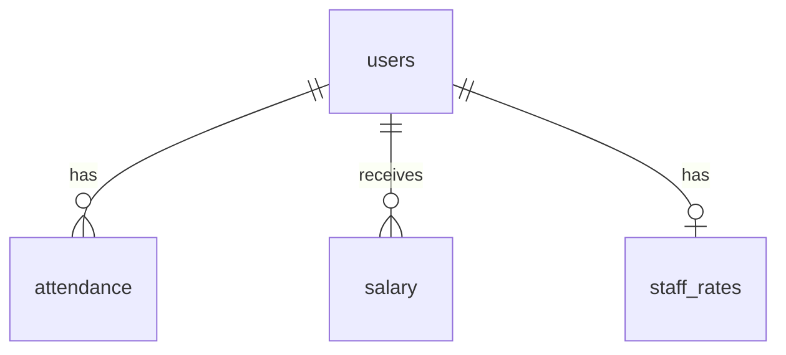

# DATABASE ANALYSIS

## Tables

### `attendance`
- `id` (uuid, PK)
- `user_id` (uuid, FK to auth.users)
- `date` (date)
- `check_in`, `check_out` (timestamptz)
- `selfie_url`, `check_out_selfie` (text)

### `staff_rates`
- `user_id` (uuid, PK)
- `base_daily_rate` (numeric)
- `ot_rate_per_hour` (numeric)

### `salary`
- `id` (uuid, PK)
- `user_id` (uuid, FK)
- `month` (int), `year` (int)
- `net_salary` (numeric)
- `status` (text: Draft, Paid)

## Relationships

