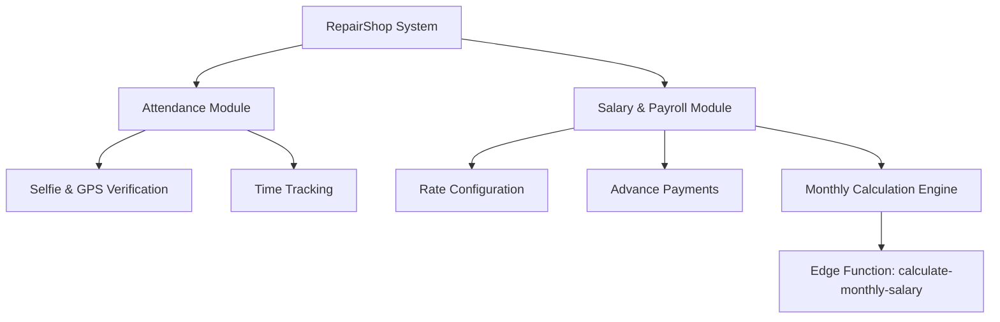

# SYSTEM OVERVIEW
## Architecture & Technology Stack

### Overall Architecture
- **Client Tier (Mobile)**: Expo React Native app. Handles daily staff operations (check-in/out).
- **Client Tier (Web)**: Next.js (React) admin panel. Handles payroll execution, salary configuration, and attendance overrides.
- **Backend Tier**: Supabase Platform.
  - **Database**: PostgreSQL with Row-Level Security.
  - **Auth**: Supabase Auth (JWT).
  - **Storage**: Supabase Storage (`attendance-selfies` bucket).
  - **Compute**: Deno-based Edge Functions.

### Module Hierarchy

