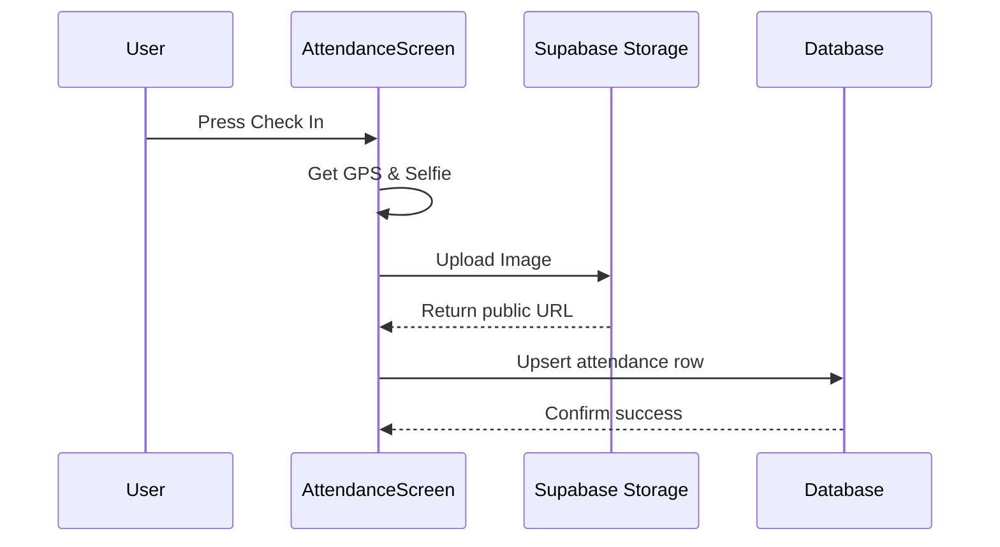

# ATTENDANCE WORKFLOW

## Step-by-Step Execution
1. **Clock In Trigger**: User presses "Check In" on `AttendanceScreen`.
2. **Permission Check**: App requests foreground location and camera permissions.
3. **Capture**: Front camera captures a selfie. Location module captures high-accuracy coordinates.
4. **Storage Upload**: Selfie is uploaded to `attendance-selfies/YYYY/MM/DD/UUID.jpg`.
5. **Database Upsert**: Row inserted into `attendance` table with `check_in`, `selfie_url`, `check_in_lat`, `check_in_lng`.
6. **Clock Out Trigger**: Later, user presses "Check Out".
7. **Database Update**: The existing row for today is updated with `check_out`, `check_out_selfie`, and check-out coordinates.

