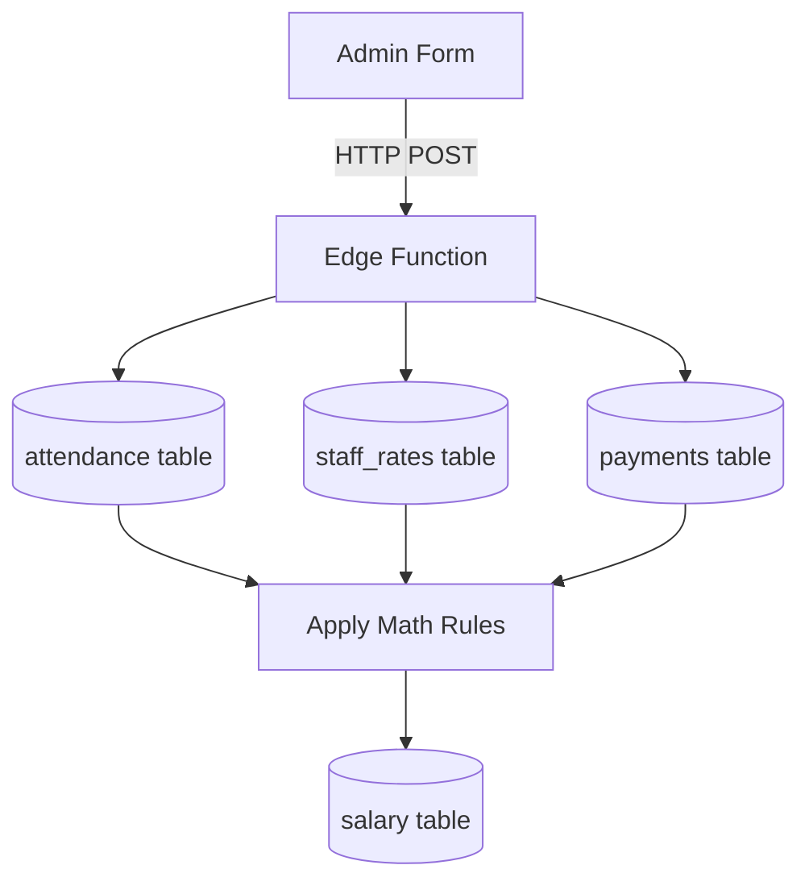

# SALARY WORKFLOW

## Step-by-Step Calculation (Edge Function)
1. **Trigger**: Admin selects Month, Year, and Staff Member. Clicks "Calculate".
2. **Edge Function Invocation**: Next.js calls `calculate-monthly-salary` endpoint.
3. **Data Aggregation**:
   - Fetch `staff_rates` (base daily pay).
   - Fetch `attendance` for the month (count present days, half days, overtime).
   - Fetch `payments` for the month where `type = 'advance_salary'`.
4. **Formula Execution**:
   - `Gross = (Present Days * Base Rate) + (Half Days * Base Rate / 2) + (Overtime Hours * OT Rate)`
   - `Deductions = (Early Hours * Early Rate) + Advance Payments`
   - `Net Salary = Gross - Deductions`
5. **Database Write**: Upsert row into `salary` table.

