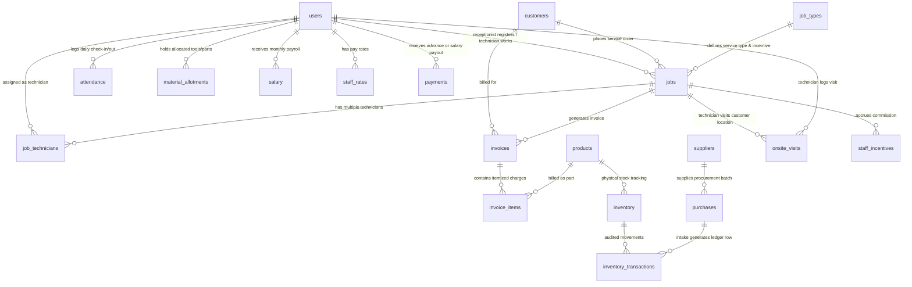
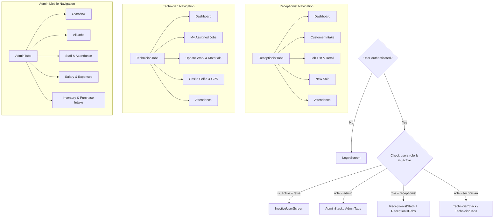
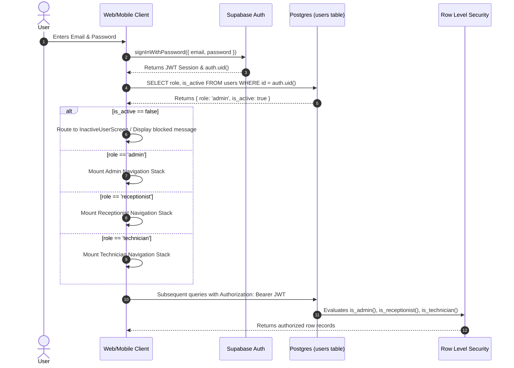

# PROJECT_DOCUMENTATION.md — Canonical System Architecture & Codebase Reference

> **Project Identity**: **RepairShop Service Management System**  
> **Repository Root**: `d:\Digital Solution`  
> **Canonical Document Version**: 1.0.0  
> **Generation Date**: 2026-08-31  
> **Target Audience**: Core Engineering Team, Solutions Architects, Security Auditors, and Technical Leadership.

---

# Table of Contents

1. [Overview & Tech Stack](#1-overview--tech-stack)
2. [Repo & Monorepo Structure](#2-repo--monorepo-structure)
3. [Database Layer](#3-database-layer)
   - 3.1 [Core Schema & Tables](#31-core-schema--tables)
   - 3.2 [Entity Relationships](#32-entity-relationships)
   - 3.3 [Row Level Security (RLS) Matrix](#33-row-level-security-rls-matrix)
   - 3.4 [PostgreSQL Functions & RPCs](#34-postgresql-functions--rpcs)
   - 3.5 [Database Triggers](#35-database-triggers)
   - 3.6 [Supabase Storage Buckets](#36-supabase-storage-buckets)
4. [App: Admin Panel (`admin-panel`)](#4-app-admin-panel-admin-panel)
   - 4.1 [Route & Page Map](#41-route--page-map)
   - 4.2 [Per-Page Detailed Documentation](#42-per-page-detailed-documentation)
5. [App: Mobile Application (`RepairShopApp`)](#5-app-mobile-application-repairshopapp)
   - 5.1 [Navigation Architecture & Screen Map](#51-navigation-architecture--screen-map)
   - 5.2 [Per-Screen Detailed Documentation](#52-per-screen-detailed-documentation)
6. [Shared Components Reference](#6-shared-components-reference)
   - 6.1 [Admin Panel Components (`admin-panel/src/components`)](#61-admin-panel-components)
   - 6.2 [Mobile App Components (`RepairShopApp/src/components`)](#62-mobile-app-components)
7. [Shared Utilities, Hooks & Contexts](#7-shared-utilities-hooks--contexts)
   - 7.1 [`@repairshop/shared` Library](#71-repairshopshared-library)
   - 7.2 [Admin Panel Hooks, Libs & Utils](#72-admin-panel-hooks-libs--utils)
   - 7.3 [Mobile App Hooks, Libs & Utils](#73-mobile-app-hooks-libs--utils)
8. [Design Tokens & Theme Reference](#8-design-tokens--theme-reference)
9. [API Routes & Server Endpoints](#9-api-routes--server-endpoints)
10. [Supabase Edge Functions Reference](#10-supabase-edge-functions-reference)
11. [Authentication & Authorization Flow (End-to-End)](#11-authentication--authorization-flow-end-to-end)
12. [Environment Variables Matrix](#12-environment-variables-matrix)
13. [Third-Party Integrations](#13-third-party-integrations)
14. [Build, Test & Deployment Architecture](#14-build-test--deployment-architecture)
15. [Observations, Gaps & Anomalies (Punch List)](#15-observations-gaps--anomalies-punch-list)

---

# 1. Overview & Tech Stack

The **RepairShop Service Management System** is an enterprise multi-role operations platform engineered for consumer electronics repair centers, service hubs, and onsite technical operations. It orchestrates customer intake, automated job assignment, itemized point-of-sale and repair billing, technician field workflows, selfie-and-geofenced staff attendance, inventory ledger management, staff payroll, and automated multi-channel notifications (Push, WhatsApp, Email).

### Core System Principles
- **Job Code Standard**: PostgreSQL sequence-generated codes following the format `RS-YYYY-XXXX` (e.g. `RS-2026-0001`). No client-side code generation is permitted ([GEMINI.md:31](file:///d:/Digital%20Solution/GEMINI.md#L31)).
- **Sale / Invoice Standard**: Sequence-generated invoice and sale codes: `INV-YYYY-XXXX` and `SALE-YYYY-XXXX`.
- **Purchase Order Standard**: Sequence-generated procurement codes: `PO-YYYY-XXXX`.
- **Zero Client-Side Service Role Key Exposure**: Anon keys only on clients; administrative operations are isolated to RLS policies or Supabase Edge Functions ([GEMINI.md:143-156](file:///d:/Digital%20Solution/GEMINI.md#L143-L156)).

### Technology Stack Summary Table

| Tier | Technology / Library | Version | Location / Config | Primary Responsibility |
| :--- | :--- | :--- | :--- | :--- |
| **Monorepo** | npm Workspaces | Node v20+ | [`package.json`](file:///d:/Digital%20Solution/package.json) | Monorepo package resolution & dependency orchestration |
| **Web Admin** | Next.js (App Router) | `16.2.9` | [`admin-panel/package.json`](file:///d:/Digital%20Solution/admin-panel/package.json) | Administrative oversight, payroll, financial reporting, inventory |
| **Web UI** | React / Tailwind CSS / PostCSS | `19.1.0` / `4.x` | [`admin-panel/src/app/globals.css`](file:///d:/Digital%20Solution/admin-panel/src/app/globals.css) | Responsive admin interface, data tables, modals |
| **Web Charts** | Recharts | `3.9.1` | [`admin-panel/src/components/dashboard/`](file:///d:/Digital%20Solution/admin-panel/src/components/dashboard/) | Operational revenue, technician productivity, and job status charts |
| **Web Maps** | Leaflet / React-Leaflet | `1.9.4` / `5.0.0` | [`admin-panel/src/components/settings/GeofenceMap.tsx`](file:///d:/Digital%20Solution/admin-panel/src/components/settings/GeofenceMap.tsx) | Interactive geofence perimeter selection & visualization |
| **Mobile App** | React Native / Expo SDK | `0.81.6` / `~54.0.0` | [`RepairShopApp/package.json`](file:///d:/Digital%20Solution/RepairShopApp/package.json) | Receptionist intake, technician execution, field attendance |
| **Mobile Nav** | React Navigation (Stack & Tabs) | `v7.x` | [`RepairShopApp/src/navigation/`](file:///d:/Digital%20Solution/RepairShopApp/src/navigation/) | Role-isolated navigation stacks (Admin, Receptionist, Technician) |
| **Mobile Hardware** | Expo Camera & Location | `~17.0.10` / `~19.0.8` | [`RepairShopApp/src/screens/shared/AttendanceScreen.tsx`](file:///d:/Digital%20Solution/RepairShopApp/src/screens/shared/AttendanceScreen.tsx) | Selfie verification, geofenced GPS verification |
| **Mobile State** | TanStack React Query | `~5.101.3` | [`RepairShopApp/package.json`](file:///d:/Digital%20Solution/RepairShopApp/package.json) | Query caching, offline data caching & optimistic updates |
| **Shared Lib** | Pure TypeScript Workspace | `1.0.0` | [`packages/shared/`](file:///d:/Digital%20Solution/packages/shared) | Shared billing calculations, phone normalization, types |
| **Database** | PostgreSQL on Supabase | 15.x / 16.x | [`supabase/migrations/`](file:///d:/Digital%20Solution/supabase/migrations) | Relational store, RLS, custom triggers, stored procedures |
| **Edge Functions** | Deno Runtime | 1.x | [`supabase/functions/`](file:///d:/Digital%20Solution/supabase/functions) | Push notifications, invoice PDF generation, payroll execution |
| **Storage** | Supabase Storage Buckets | S3-compatible | [`supabase/migrations/`](file:///d:/Digital%20Solution/supabase/migrations) | Attendance selfies, job attachments, onsite verification, invoices |

---

# 2. Repo & Monorepo Structure

```
d:\Digital Solution
├── .github/
│   └── workflows/
│       └── ci.yml                     # Continuous integration workflow for lint & build validation
├── admin-panel/                       # [Workspace: admin-panel] Next.js 16 App Router Web Portal
│   ├── public/                        # Static assets (favicons, icons)
│   ├── src/
│   │   ├── app/                       # Next.js App Router root & routes
│   │   │   ├── (admin)/               # Authenticated Admin Route Group (Role-guarded)
│   │   │   │   ├── attendance/        # Staff attendance logs, filters, live status
│   │   │   │   ├── customers/         # Customer directory, CRM profile editing, stats
│   │   │   │   ├── expenditure/       # Business expense logging, categories, vouchers
│   │   │   │   ├── inventory/         # Product catalog, stock adjustments, purchase intake
│   │   │   │   ├── job-types/         # Service catalog, technician profit incentives
│   │   │   │   ├── jobs/              # Job list, job creation, comprehensive job detail
│   │   │   │   ├── materials/         # Material allocations, technician return approvals
│   │   │   │   ├── pending-payments/  # Unpaid invoices & job balance reconciliation
│   │   │   │   ├── reports/           # Financial, technician, attendance, inventory analytics
│   │   │   │   ├── salary/            # Payroll calculation, advance salary, bonuses, leaves
│   │   │   │   ├── sales/             # POS sales directory, direct counter sale intake
│   │   │   │   ├── settings/          # Shop profile, geofence boundary, WhatsApp credentials
│   │   │   │   ├── staff/             # Staff management, user activation, leave approvals
│   │   │   │   ├── layout.tsx         # Admin layout container with Sidebar & Topbar
│   │   │   │   └── page.tsx           # Executive dashboard metrics & recent pipeline
│   │   │   ├── api/test/route.ts      # Health-check / diagnostic API endpoint
│   │   │   ├── globals.css            # Tailwind v4 configuration, custom CSS utilities
│   │   │   ├── layout.tsx             # Root layout with ToastProvider & AuthProvider
│   │   │   └── login/page.tsx         # Admin authentication login screen
│   │   ├── components/                # 70+ Modular React components
│   │   │   ├── attendance/            # StaffAttendanceDrawer
│   │   │   ├── billing/               # PaymentRecordingBox
│   │   │   ├── catalog/               # JobTypeFormModal
│   │   │   ├── common/                # Buttons, Modals, Badges, Tables, Inputs, Skeletons
│   │   │   ├── customers/             # CustomerTypeahead
│   │   │   ├── dashboard/             # RevenueChart, JobsPieChart, TechPerformanceChart
│   │   │   ├── expenditure/           # ExpenditureForm, SummaryCards, ExpenditureTable
│   │   │   ├── inventory/             # AddStockModal, InventoryFormModal, PurchaseIntakeModal
│   │   │   ├── jobs/                  # AssignmentCard, CustomerInfoCard, JobBillingCard...
│   │   │   ├── layout/                # Sidebar, Topbar, AdminLayout, NotificationsDropdown
│   │   │   ├── salary/                # PayrollRunPanel, SalaryCalculatorForm, LeaveManagement
│   │   │   ├── settings/              # GeofenceMap (Leaflet)
│   │   │   ├── staff/                 # AddStaffModal
│   │   │   └── suppliers/             # SupplierTypeahead
│   │   ├── constants/colors.ts        # Color token constants
│   │   ├── context/                   # AuthContext, AppConfigContext
│   │   ├── hooks/useCountUp.ts        # Numerical animation hook for KPI counters
│   │   ├── lib/                       # supabase.ts, tokens.ts, utils.ts, driveHelpers.ts...
│   │   ├── types/                     # inventory.ts, salary.ts, sales.ts
│   │   └── utils/                     # formatters, CSV exporters, receipt and slip HTML generators
│   ├── next.config.ts                 # Next.js configuration
│   ├── postcss.config.mjs             # PostCSS Tailwind plugins
│   ├── tsconfig.json                  # TypeScript compiler options
│   └── package.json                   # Web dependencies and scripts
│
├── RepairShopApp/                     # [Workspace: repairshopapp] React Native / Expo Mobile App
│   ├── assets/                        # App icons, splash screens, branding media
│   ├── src/
│   │   ├── components/                # 58 React Native modular components
│   │   │   ├── billing/               # BillingFormCards, ItemizedBillTable, PaymentRecordingBox
│   │   │   ├── common/                # AppHeader, Button, BottomSheet, Toast, ScreenScrollView
│   │   │   ├── customers/             # CustomerTypeaheadMobile
│   │   │   ├── inventory/             # InventoryFormSheet, PurchaseIntakeModalMobile
│   │   │   ├── jobs/                  # JobCard, JobList, TechnicianPicker, PriorityBadge
│   │   │   ├── materials/             # AddMaterialModal, MaterialCameraView, MaterialList
│   │   │   ├── profile/               # PhotoPickerModal, ProfileInfoCard, ProfilePasswordCard
│   │   │   ├── salary/                # LeaveApplicationCard, SalaryBreakdownCard, HeroCard
│   │   │   ├── sales/                 # SaleCustomerForm, SaleItemsList, SalePaymentForm
│   │   │   ├── shared/                # RoleDashboard, SelfieCapture, Dropdown, SegmentedControl
│   │   │   ├── suppliers/             # SupplierTypeaheadMobile
│   │   │   └── work/                  # CompletionSelfieBanner, MaterialUsageModal
│   │   ├── context/                   # AuthContext, AppConfigContext, ToastContext, PdfProgress
│   │   ├── hooks/                     # usePushNotifications, useCameraPermission, useRealtime...
│   │   ├── lib/                       # auth.ts, supabase.ts, invoiceService.ts
│   │   ├── navigation/                # RootNavigator, AdminStack, ReceptionistStack, TechnicianStack
│   │   ├── screens/                   # 36 Full Mobile Screens
│   │   │   ├── admin/                 # OverviewScreen, StaffScreen, SalaryScreen, Expenditure...
│   │   │   ├── auth/                  # LoginScreen (Email/Password, Remember Me, Biometrics UI)
│   │   │   ├── receptionist/          # Dashboard, CustomerIntake, JobAssignment, Billing...
│   │   │   ├── shared/                # AttendanceScreen, InventoryScreen, ProfileScreen...
│   │   │   └── technician/            # TechnicianDashboard, MyJobs, UpdateWork, OnsiteVisit...
│   │   ├── tokens.ts                  # Design tokens (colors, spacing, radius, typography, shadows)
│   │   ├── types/                     # attendance.ts, billing.ts, job.ts, onsiteVisit.ts, user.ts
│   │   └── utils/                     # compressImage.ts, distance.ts, storagePaths.ts...
│   ├── app.json                       # Expo Application manifest & permission descriptors
│   ├── eas.json                       # Expo Application Services build & release profiles
│   ├── metro.config.js                # Metro bundler config with workspace resolution
│   ├── tsconfig.json                  # React Native TypeScript config
│   └── package.json                   # Mobile dependencies and run scripts
│
├── packages/
│   └── shared/                        # [Workspace: @repairshop/shared] Shared Core Business Logic
│       ├── src/
│       │   ├── badgeConfig.ts         # Central status badge color maps and labels
│       │   ├── billing.ts             # Tax, discount, subtotal, and itemized billing math engine
│       │   ├── date.ts                # Canonical date and timestamp formatting helpers
│       │   ├── formatCurrency.ts      # Standard INR currency formatters
│       │   ├── imageUtils.ts          # Client-side image dimension & compression calculations
│       │   ├── incentive.ts           # Technician incentive & profit-sharing calculations
│       │   ├── phone.ts               # Indian phone number sanitization & WhatsApp URI builder
│       │   ├── storageUrlCache.ts     # In-memory signed URL cache with TTL invalidation
│       │   ├── types.ts               # Shared database row types and enum declarations
│       │   └── hooks/
│       │       └── useDebounceValue.ts# Shared debounce hook for typeaheads
│       ├── package.json               # Shared package config
│       └── tsconfig.json              # Shared TypeScript config
│
├── supabase/                          # Supabase Backend Configuration & Database Engine
│   ├── functions/                     # 21 Serverless Deno Edge Functions
│   │   ├── _shared/                   # Shared Google Drive, Auth, Excel, and Notification logic
│   │   ├── admin-create-user/         # Administrative user provisioning via Supabase Admin Auth
│   │   ├── admin-delete-user/         # User deactivation & cleanup
│   │   ├── calculate-monthly-salary/  # Payroll execution engine
│   │   ├── export-attendance-reports/ # Monthly attendance Excel sheet builder
│   │   ├── export-monthly-data/       # Full monthly business backup (Drive/Excel)
│   │   ├── generate-invoice/          # SVG/PDF Invoice document generator
│   │   ├── notify-on-finance-event/   # Financial transaction notifications
│   │   ├── notify-on-inventory-change/# Low stock & purchase alerts
│   │   ├── notify-on-job-created/     # Job intake push & WhatsApp triggers
│   │   ├── notify-on-late-checkin/    # Late attendance alerts
│   │   ├── notify-on-leave-event/     # Leave application and approval alerts
│   │   ├── notify-on-material-event/  # Material allotment and return notifications
│   │   ├── notify-on-onsite-visit/    # Technician onsite arrival/departure notifications
│   │   ├── notify-on-status-change/   # Job lifecycle status change triggers
│   │   ├── process-pending-uploads/   # Resilient background worker for Google Drive sync
│   │   ├── send-invoice-email/        # Transactional invoice emails via Resend API
│   │   ├── test-drive-auth/           # Google Drive OAuth verification endpoint
│   │   ├── upload-attendance-selfie/  # Direct-to-Drive attendance backup
│   │   ├── upload-avatar/             # Staff profile avatar processor
│   │   ├── upload-job-photo/          # Diagnostic job photo processor
│   │   └── upload-material-photo/     # Proof of purchase/material photo processor
│   ├── migrations/                    # 34 Active Chronological SQL Migrations
│   └── config.toml                    # Supabase local environment configuration
│
├── docs/                              # Technical Specification & Runbook Documentation
│   ├── admin-vercel-deployment.md     # Production Vercel deployment guide
│   ├── environment-variables.md       # Master environment variables dictionary
│   ├── google-drive-integration.md    # Google Drive service account & OAuth runbook
│   ├── mobile-deployment.md           # Expo EAS build & release instructions
│   ├── production-checklist.md        # Pre-launch security & verification checklist
│   └── rls-testing.md                 # Role Level Security testing matrix
│
├── scripts/                           # Administrative, Testing & Build Scripts
│   ├── generate_all_logos.js          # Multi-resolution branding asset generator
│   ├── get-google-refresh-token.mjs   # Interactive OAuth token generator for Google Drive
│   └── rls-smoke-test.ts              # Automated RLS boundary validation script
│
├── GEMINI.md                          # Global system rules, role boundaries & coding standards
├── SKILL.md                           # Master implementation specification & schema source of truth
└── package.json                       # Root workspace configuration
```

---

# 3. Database Layer

## 3.1 Core Schema & Tables

The system schema is established across 34 active migrations in [`supabase/migrations/`](file:///d:/Digital%20Solution/supabase/migrations). All primary keys use UUIDs generated via `gen_random_uuid()`. Timestamps default to `NOW()`.

### 1. `users` (Staff Directory & Auth Profile)
- **File**: [`20260819000000_baseline_schema.sql:15-32`](file:///d:/Digital%20Solution/supabase/migrations/20260819000000_baseline_schema.sql#L15-L32), [`20260821700000_add_user_last_login_at.sql:5`](file:///d:/Digital%20Solution/supabase/migrations/20260821700000_add_user_last_login_at.sql#L5), [`20260822140000_profile_pictures_and_avatars.sql:6`](file:///d:/Digital%20Solution/supabase/migrations/20260822140000_profile_pictures_and_avatars.sql#L6)
- **Primary Key**: `id` UUID (Foreign key to `auth.users.id` ON DELETE CASCADE).
- **Columns**:
  - `id` UUID NOT NULL PRIMARY KEY
  - `name` TEXT NOT NULL
  - `email` TEXT UNIQUE NOT NULL
  - `role` TEXT NOT NULL CHECK (`role IN ('admin', 'receptionist', 'technician')`)
  - `phone` TEXT
  - `is_active` BOOLEAN NOT NULL DEFAULT true
  - `avatar_url` TEXT
  - `last_login_at` TIMESTAMPTZ
  - `created_at` TIMESTAMPTZ NOT NULL DEFAULT NOW()
  - `updated_at` TIMESTAMPTZ NOT NULL DEFAULT NOW()

### 2. `jobs` (Service Orders & Repairs)
- **File**: [`20260819000000_baseline_schema.sql:43-77`](file:///d:/Digital%20Solution/supabase/migrations/20260819000000_baseline_schema.sql#L43-L77), [`20260820200000_customers_module.sql:12`](file:///d:/Digital%20Solution/supabase/migrations/20260820200000_customers_module.sql#L12), [`20260822100001_job_type_technician_flow.sql:15`](file:///d:/Digital%20Solution/supabase/migrations/20260822100001_job_type_technician_flow.sql#L15)
- **Primary Key**: `id` UUID DEFAULT gen_random_uuid()
- **Columns**:
  - `id` UUID NOT NULL PRIMARY KEY
  - `job_code` TEXT UNIQUE NOT NULL (Generated via `generate_job_code()`)
  - `customer_name` TEXT NOT NULL
  - `customer_contact` TEXT NOT NULL
  - `customer_id` UUID REFERENCES `customers(id)` ON DELETE SET NULL
  - `device_type` TEXT NOT NULL
  - `brand` TEXT
  - `model` TEXT
  - `serial_number` TEXT
  - `passcode` TEXT
  - `issue_description` TEXT NOT NULL
  - `status` TEXT NOT NULL DEFAULT 'Received' CHECK (`status IN ('Received', 'In Progress', 'Waiting for Materials', 'Completed', 'Delivered', 'Cancelled')`)
  - `priority` TEXT NOT NULL DEFAULT 'Medium' CHECK (`priority IN ('Low', 'Medium', 'High', 'Urgent')`)
  - `service_location` TEXT NOT NULL DEFAULT 'In-Shop' CHECK (`service_location IN ('In-Shop', 'Onsite')`)
  - `onsite_address` TEXT
  - `service_type` TEXT
  - `job_type_ref_id` UUID REFERENCES `job_types(id)` ON DELETE SET NULL
  - `technician_id` UUID REFERENCES `users(id)` ON DELETE SET NULL
  - `receptionist_id` UUID NOT NULL REFERENCES `users(id)`
  - `estimated_cost` NUMERIC(10,2) DEFAULT 0
  - `advance_paid` NUMERIC(10,2) DEFAULT 0
  - `labour_charge` NUMERIC(10,2) DEFAULT 0
  - `expected_delivery_date` DATE
  - `customer_notes` TEXT
  - `technician_notes` TEXT
  - `photo_urls` TEXT[] DEFAULT '{}'
  - `status_changed_at` TIMESTAMPTZ DEFAULT NOW()
  - `completed_at` TIMESTAMPTZ
  - `delivered_at` TIMESTAMPTZ
  - `cancelled_at` TIMESTAMPTZ
  - `created_at` TIMESTAMPTZ NOT NULL DEFAULT NOW()
  - `updated_at` TIMESTAMPTZ NOT NULL DEFAULT NOW()

### 3. `job_technicians` (Multi-Technician Assignment & Equal Split)
- **File**: [`20260822110000_multi_technician_equal_incentive.sql:6-21`](file:///d:/Digital%20Solution/supabase/migrations/20260822110000_multi_technician_equal_incentive.sql#L6-L21)
- **Primary Key**: `id` UUID DEFAULT gen_random_uuid()
- **Unique Constraint**: `UNIQUE(job_id, technician_id)`
- **Columns**:
  - `id` UUID PRIMARY KEY
  - `job_id` UUID NOT NULL REFERENCES `jobs(id)` ON DELETE CASCADE
  - `technician_id` UUID NOT NULL REFERENCES `users(id)` ON DELETE CASCADE
  - `is_primary` BOOLEAN NOT NULL DEFAULT false
  - `created_at` TIMESTAMPTZ DEFAULT NOW()

### 4. `customers` (Unified Customer Registry)
- **File**: [`20260820200000_customers_module.sql:5-24`](file:///d:/Digital%20Solution/supabase/migrations/20260820200000_customers_module.sql#L5-L24)
- **Columns**:
  - `id` UUID NOT NULL PRIMARY KEY DEFAULT gen_random_uuid()
  - `name` TEXT NOT NULL
  - `phone` TEXT UNIQUE NOT NULL
  - `email` TEXT
  - `gstin` TEXT
  - `address` TEXT
  - `created_via` TEXT DEFAULT 'manual'
  - `created_at` TIMESTAMPTZ DEFAULT NOW()
  - `updated_at` TIMESTAMPTZ DEFAULT NOW()

### 5. `invoices` & `invoice_items` (Billing Engine)
- **File**: [`20260819000000_baseline_schema.sql:180-230`](file:///d:/Digital%20Solution/supabase/migrations/20260819000000_baseline_schema.sql#L180-L230), [`20260822100000_itemized_billing_enhancements.sql:10-40`](file:///d:/Digital%20Solution/supabase/migrations/20260822100000_itemized_billing_enhancements.sql#L10-L40), [`20260822160000_add_tax_columns_to_items.sql`](file:///d:/Digital%20Solution/supabase/migrations/20260822160000_add_tax_columns_to_items.sql)
- **`invoices` Table**:
  - `id` UUID PRIMARY KEY DEFAULT gen_random_uuid()
  - `invoice_code` TEXT UNIQUE NOT NULL (Format: `INV-YYYY-XXXX`)
  - `job_id` UUID REFERENCES `jobs(id)` ON DELETE SET NULL
  - `customer_name` TEXT NOT NULL
  - `customer_contact` TEXT
  - `customer_email` TEXT
  - `customer_gstin` TEXT
  - `tax_regime` TEXT NOT NULL DEFAULT 'intra_state' CHECK (`tax_regime IN ('intra_state', 'inter_state', 'exempt')`)
  - `subtotal` NUMERIC(10,2) NOT NULL DEFAULT 0
  - `discount` NUMERIC(10,2) NOT NULL DEFAULT 0
  - `cgst_amount` NUMERIC(10,2) NOT NULL DEFAULT 0
  - `sgst_amount` NUMERIC(10,2) NOT NULL DEFAULT 0
  - `igst_amount` NUMERIC(10,2) NOT NULL DEFAULT 0
  - `grand_total` NUMERIC(10,2) NOT NULL DEFAULT 0
  - `amount_paid` NUMERIC(10,2) NOT NULL DEFAULT 0
  - `status` TEXT NOT NULL DEFAULT 'draft' CHECK (`status IN ('draft', 'partial', 'paid', 'cancelled')`)
  - `payment_method` TEXT DEFAULT 'Cash'
  - `notes` TEXT
  - `drive_file_id` TEXT
  - `drive_web_view_link` TEXT
  - `created_at` TIMESTAMPTZ NOT NULL DEFAULT NOW()
  - `paid_at` TIMESTAMPTZ
- **`invoice_items` Table**:
  - `id` UUID PRIMARY KEY DEFAULT gen_random_uuid()
  - `invoice_id` UUID NOT NULL REFERENCES `invoices(id)` ON DELETE CASCADE
  - `item_type` TEXT NOT NULL CHECK (`item_type IN ('part', 'labour', 'job_type', 'custom')`)
  - `product_id` UUID REFERENCES `products(id)` ON DELETE SET NULL
  - `inventory_id` UUID REFERENCES `inventory(id)` ON DELETE SET NULL
  - `job_type_id` UUID REFERENCES `job_types(id)` ON DELETE SET NULL
  - `description` TEXT NOT NULL
  - `quantity` NUMERIC(10,2) NOT NULL DEFAULT 1
  - `unit_price` NUMERIC(10,2) NOT NULL DEFAULT 0
  - `cgst_rate` NUMERIC(5,2) DEFAULT 0
  - `sgst_rate` NUMERIC(5,2) DEFAULT 0
  - `igst_rate` NUMERIC(5,2) DEFAULT 0
  - `cgst_amount` NUMERIC(10,2) DEFAULT 0
  - `sgst_amount` NUMERIC(10,2) DEFAULT 0
  - `igst_amount` NUMERIC(10,2) DEFAULT 0
  - `total_price` NUMERIC(10,2) NOT NULL DEFAULT 0

### 6. `sales` & `sale_items` (Point-of-Sale Module)
- **File**: [`20260819000000_baseline_schema.sql:235-275`](file:///d:/Digital%20Solution/supabase/migrations/20260819000000_baseline_schema.sql#L235-L275), [`20260822160000_add_tax_columns_to_items.sql`](file:///d:/Digital%20Solution/supabase/migrations/20260822160000_add_tax_columns_to_items.sql)
- **`sales` Table**:
  - `id` UUID PRIMARY KEY DEFAULT gen_random_uuid()
  - `sale_code` TEXT UNIQUE NOT NULL (Format: `SALE-YYYY-XXXX`)
  - `invoice_id` UUID REFERENCES `invoices(id)` ON DELETE SET NULL
  - `customer_name` TEXT NOT NULL
  - `customer_contact` TEXT
  - `sale_type_id` UUID REFERENCES `sale_types(id)` ON DELETE SET NULL
  - `sold_by` UUID NOT NULL REFERENCES `users(id)`
  - `subtotal` NUMERIC(10,2) NOT NULL DEFAULT 0
  - `discount` NUMERIC(10,2) NOT NULL DEFAULT 0
  - `tax_amount` NUMERIC(10,2) NOT NULL DEFAULT 0
  - `grand_total` NUMERIC(10,2) NOT NULL DEFAULT 0
  - `payment_method` TEXT DEFAULT 'Cash'
  - `status` TEXT NOT NULL DEFAULT 'completed' CHECK (`status IN ('draft', 'completed', 'cancelled')`)
  - `created_at` TIMESTAMPTZ DEFAULT NOW()
- **`sale_items` Table**:
  - `id` UUID PRIMARY KEY DEFAULT gen_random_uuid()
  - `sale_id` UUID NOT NULL REFERENCES `sales(id)` ON DELETE CASCADE
  - `product_id` UUID NOT NULL REFERENCES `products(id)`
  - `inventory_id` UUID NOT NULL REFERENCES `inventory(id)`
  - `quantity` NUMERIC(10,2) NOT NULL DEFAULT 1
  - `unit_price` NUMERIC(10,2) NOT NULL DEFAULT 0
  - `total_price` NUMERIC(10,2) NOT NULL DEFAULT 0

### 7. `products`, `inventory` & `inventory_transactions` (Double-Entry Inventory)
- **File**: [`20260819000000_baseline_schema.sql:120-175`](file:///d:/Digital%20Solution/supabase/migrations/20260819000000_baseline_schema.sql#L120-L175), [`20260821600000_inventory_stock_lifecycle_fixes.sql`](file:///d:/Digital%20Solution/supabase/migrations/20260821600000_inventory_stock_lifecycle_fixes.sql)
- **`products` Table**: Catalog definition (name, SKU, unit, HSN/SAC, CGST/SGST/IGST rates, tax mode: `inclusive` vs `exclusive`).
- **`inventory` Table**: Physical stock record (`quantity_cached`, `purchase_rate`, `selling_rate`, `low_stock_threshold`, `minimum_stock_level`, `location`).
- **`inventory_transactions` (Stock Ledger)**:
  - Immutable transaction log: `transaction_type IN ('PURCHASE', 'SALE', 'JOB_USAGE', 'JOB_RETURN', 'ADJUSTMENT', 'TRANSFER', 'OPENING_STOCK')`.
  - Positive quantities increment physical stock; negative quantities decrement stock.
  - Enforced by trigger `ledger_sync_inventory_quantity` and prevented from mutation by `prevent_ledger_mutation`.

### 8. `material_allotments` & `job_materials` (Technician Parts & Requisitions)
- **File**: [`20260820100000_allocated_materials_lifecycle.sql:5-45`](file:///d:/Digital%20Solution/supabase/migrations/20260820100000_allocated_materials_lifecycle.sql#L5-L45)
- **`material_allotments` Table**:
  - Parts issued directly to a technician for field vans or active job holds.
  - Columns: `id`, `technician_id`, `product_id`, `inventory_id`, `job_id`, `quantity_allotted`, `quantity_used`, `quantity_returned`, `unit_cost`, `status IN ('allocated', 'in_use', 'used', 'returned')`.
- **`job_materials` Table**:
  - Parts consumed directly inside a job order (`job_id`, `inventory_id`, `product_id`, `quantity`, `unit_price`, `total_price`, `photo_urls`, `allotment_id`).

### 9. `attendance` & `onsite_visits` (Attendance & Field Operations)
- **File**: [`20260819000000_baseline_schema.sql:85-115`](file:///d:/Digital%20Solution/supabase/migrations/20260819000000_baseline_schema.sql#L85-L115)
- **`attendance` Table**:
  - `id` UUID PRIMARY KEY DEFAULT gen_random_uuid()
  - `user_id` UUID NOT NULL REFERENCES `users(id)` ON DELETE CASCADE
  - `date` DATE NOT NULL
  - `check_in_time` TIMESTAMPTZ
  - `check_out_time` TIMESTAMPTZ
  - `check_in_latitude` NUMERIC(10,8), `check_in_longitude` NUMERIC(11,8)
  - `check_out_latitude` NUMERIC(10,8), `check_out_longitude` NUMERIC(11,8)
  - `check_in_selfie_url` TEXT, `check_out_selfie_url` TEXT
  - `status` TEXT NOT NULL DEFAULT 'Present' CHECK (`status IN ('Present', 'Half-Day', 'Leave', 'Absent')`)
  - `is_late` BOOLEAN DEFAULT false, `late_minutes` INTEGER DEFAULT 0
  - `early_departure` BOOLEAN DEFAULT false, `early_minutes` INTEGER DEFAULT 0
  - `overtime_minutes` INTEGER DEFAULT 0
  - `is_approved` BOOLEAN DEFAULT true
  - `leave_type` TEXT
  - `leave_reason` TEXT
  - **Constraint**: `UNIQUE(user_id, date)`
- **`onsite_visits` Table**:
  - `id` UUID PRIMARY KEY DEFAULT gen_random_uuid()
  - `job_id` UUID NOT NULL REFERENCES `jobs(id)` ON DELETE CASCADE
  - `technician_id` UUID NOT NULL REFERENCES `users(id)` ON DELETE CASCADE
  - `arrival_time` TIMESTAMPTZ, `departure_time` TIMESTAMPTZ
  - `arrival_latitude` NUMERIC(10,8), `arrival_longitude` NUMERIC(11,8)
  - `departure_latitude` NUMERIC(10,8), `departure_longitude` NUMERIC(11,8)
  - `arrival_selfie_url` TEXT, `departure_selfie_url` TEXT
  - `notes` TEXT

### 10. Payroll & Financial Tables (`salary`, `staff_rates`, `staff_incentives`, `payments`, `employee_bonus`, `employee_leave`)
- **`staff_rates`**: Configures `base_daily_rate`, `ot_rate_per_hour`, `early_deduction_per_hour`, `halfday_deduction_rate` per staff member.
- **`salary`**: Monthly finalized salary records (`gross_salary`, `net_salary`, `present_days`, `half_days`, `leave_days`, `overtime_pay`, `deductions`, `advance_deductions`, `bonus_amount`, `incentives_amount`, `is_finalized`, `slip_url`).
- **`staff_incentives`**: Accrues technician commissions automatically when jobs complete based on active `job_types` incentives. Split equally across assigned technicians.
- **`payments`**: Operational expenditure and advance salary payouts (`type IN ('advance_salary', 'salary_payout', 'rent', 'utilities', 'vendor_payment', 'office_supplies', 'travel', 'food', 'other')`). Automatically synched to expenditure ledger on salary finalization via trigger `trigger_salary_to_expenditure`.

### 11. Procurement & Suppliers (`suppliers`, `purchases`, `purchase_audit_log`)
- **File**: [`20260821300000_inventory_purchase_intake_module.sql:5-45`](file:///d:/Digital%20Solution/supabase/migrations/20260821300000_inventory_purchase_intake_module.sql#L5-L45)
- Tracks vendor procurement batches, supplier invoices, PO codes (`PO-YYYY-XXXX`), and tax breakdowns.

### 12. Settings & System Audit (`geofence_settings`, `whatsapp_settings`, `notifications`, `pending_uploads`)
- **`geofence_settings`**: Shop lat/long, radius meters (default 100m), strict geofencing enforcement toggle.
- **`whatsapp_settings`**: Twilio provider settings, template configurations.
- **`notifications`**: In-app and push notification event archive.
- **`pending_uploads`**: Offline/failed Google Drive sync retry queue.

---

## 3.2 Entity Relationships



---

## 3.3 Row Level Security (RLS) Matrix

RLS is enabled and enforced across all database tables. The RLS policies rely on PostgreSQL security helper functions: `is_admin()`, `is_receptionist()`, `is_technician()`, `is_staff()`, and `get_user_role()`.

| Table | SELECT Policy | INSERT Policy | UPDATE Policy | DELETE Policy |
| :--- | :--- | :--- | :--- | :--- |
| **`users`** | Active staff can view all active users | Admin only (`is_admin()`) | Admin can update all; users can update own name/avatar | Admin only (`is_admin()`) |
| **`jobs`** | Admin & Receptionist view all; Technician views assigned (`technician_id = auth.uid()` OR in `job_technicians`) | Admin & Receptionist only | Admin & Receptionist update all; Assigned Tech can update status/notes | Admin only |
| **`job_technicians`** | Staff view all | Admin & Receptionist | Admin & Receptionist | Admin & Receptionist |
| **`attendance`** | Admin views all; Staff view own (`user_id = auth.uid()`) | Staff insert own record | Staff update own record; Admin approves | Admin only |
| **`onsite_visits`** | Admin & Receptionist view all; Tech views own | Assigned Tech logs visit | Assigned Tech updates visit | Admin only |
| **`invoices`** | Admin & Receptionist view all; Tech NO ACCESS | Admin & Receptionist only | Admin & Receptionist only | Admin only |
| **`invoice_items`** | Admin & Receptionist view all | Admin & Receptionist only | Admin & Receptionist only | Admin only |
| **`sales` / `sale_items`** | Admin & Receptionist view all | Admin & Receptionist only | Admin & Receptionist only | Admin only |
| **`products` / `inventory`** | All authenticated staff can read | Admin only | Admin only | Admin only |
| **`inventory_transactions`**| All authenticated staff can read | System / RPC only | Immutable (Trigger blocks update) | Immutable (Trigger blocks delete) |
| **`material_allotments`** | Admin views all; Tech views own allotments | Admin only | Admin & Tech (return/use) | Admin only |
| **`job_materials`** | Admin, Receptionist & Assigned Tech | Admin, Receptionist & Assigned Tech | Admin & Assigned Tech | Admin only |
| **`salary`** | Admin only (`is_admin()`); Tech/Receptionist NO ACCESS | Admin only | Admin only | Admin only |
| **`staff_rates`** | Admin only (`is_admin()`) | Admin only | Admin only | Admin only |
| **`staff_incentives`** | Admin views all; Tech views own accrued | System / Trigger only | System / Trigger only | Admin only |
| **`payments` (Expenses)** | Admin only (`is_admin()`) | Admin only | Admin only | Admin only |
| **`employee_bonus`** | Admin only | Admin only | Admin only | Admin only |
| **`employee_leave`** | Admin views all; Staff view own leaves | Staff apply for own leave | Admin approves; Staff can cancel pending | Admin only |
| **`customers`** | All authenticated staff can read | All authenticated staff | All authenticated staff | Admin only |
| **`suppliers` / `purchases`**| All authenticated staff can read | Admin only | Admin only | Admin only |
| **`notifications`** | User views own (`recipient_user_id = auth.uid()`) | System / Staff | Recipient marks as read | Admin only |
| **`geofence_settings`** | All authenticated staff can read | Admin only | Admin only | Admin only |
| **`whatsapp_settings`** | Admin only | Admin only | Admin only | Admin only |

---

## 3.4 PostgreSQL Functions & RPCs

### 1. Security & Role Helper Functions
- `is_admin() -> BOOLEAN`: Checks if `role = 'admin'` and `is_active = true` for `auth.uid()`.
- `is_receptionist() -> BOOLEAN`: Checks if `role = 'receptionist'` and `is_active = true`.
- `is_technician() -> BOOLEAN`: Checks if `role = 'technician'` and `is_active = true`.
- `is_staff() -> BOOLEAN`: Checks if caller is active in any valid role.

### 2. Sequence Generators (Server-Enforced Uniqueness)
- `generate_job_code() -> TEXT`: Atomically increments `job_code_seq` to generate format `RS-YYYY-XXXX` ([SKILL.md:65](file:///d:/Digital%20Solution/SKILL.md#L65)).
- `generate_invoice_code() -> TEXT`: Atomically increments `invoice_code_seq` to generate format `INV-YYYY-XXXX`.
- `generate_sale_code() -> TEXT`: Atomically increments `sale_code_seq` to generate format `SALE-YYYY-XXXX`.
- `generate_purchase_code() -> TEXT`: Generates format `PO-YYYY-XXXX`.

### 3. Business Logic & Transactional RPCs
- **`create_invoice(p_customer_name, p_customer_contact, p_customer_email, p_customer_gstin, p_tax_regime, p_items, p_discount, p_payment_method, p_status, p_notes, p_job_id, p_amount_paid) -> JSONB`**:
  - Atomically creates an invoice, inserts itemized rows (`invoice_items`), validates CGST/SGST/IGST tax regimes, updates linked job status/billing attributes, decrements inventory stock ledger for parts, and returns created invoice payload.
- **`preview_invoice(p_items, p_tax_regime, p_discount) -> JSONB`**:
  - Calculates subtotal, CGST, SGST, IGST, discount, and grand total without writing to the database.
- **`record_payment(p_invoice_id, p_amount, p_payment_method, p_notes) -> JSONB`**:
  - Records a partial or full payment against an existing invoice. Updates `amount_paid`, adjusts status to `paid` or `partial`, and timestamps `paid_at`.
- **`log_inventory_purchase(...) -> JSONB`**:
  - Creates/updates product and inventory records, records procurement purchase order in `purchases`, creates `PURCHASE` stock transaction in `inventory_transactions`, and updates cached inventory quantities.
- **`add_stock(p_product_id, p_quantity, p_rate, p_notes, p_serial_numbers) -> VOID`**:
  - Adds stock to existing inventory item by inserting an `ADJUSTMENT` ledger entry.
- **`create_product_with_opening_stock(...) -> UUID`**:
  - Atomic product creation with opening stock ledger entry.
- **`search_products_catalog(p_query, p_limit) -> TABLE(...)`**:
  - Performs indexed full-text/trigram search across products, SKUs, and inventory.
- **`search_customers_v2(p_query, p_limit, p_offset) -> TABLE(...)`**:
  - Multi-attribute customer search matching phone, name, email, or GSTIN, computing aggregated job and POS sales counts.
- **`find_or_create_customer(...) -> public.customers`**:
  - Upserts customer record idempotently by phone number.
- **`complete_job_materials(p_job_id, p_materials, p_work_notes, p_technician_id) -> JSONB`**:
  - Technician completion flow: records consumed materials, updates material allotment quantities, inserts `job_materials` entries, and logs final work notes.
- **`return_allocated_material(p_allotment_id, p_user_id) -> JSONB`**:
  - Approves material return, decrements allotment, and returns parts to stock ledger.
- **`assign_job_technicians(p_job_id, p_technician_ids, p_caller_id) -> JSONB`**:
  - Atomically assigns multiple technicians to a job, designates the first as primary, and updates `jobs.technician_id`.

---

## 3.5 Database Triggers

1. **`trg_set_job_completed_at` ON `jobs`**: Automatically sets `completed_at = NOW()` when `status` transitions to `'Completed'`.
2. **`trg_sync_initial_technician` ON `jobs`**: Automatically creates a record in `job_technicians` when `technician_id` is populated on job creation.
3. **`trg_sync_primary_technician` ON `job_technicians`**: Synchronizes the primary technician ID back to `jobs.technician_id`.
4. **`trg_accrue_incentives` ON `jobs`**: Accrues technician commission in `staff_incentives` when job status becomes `'Completed'`, dividing profit share equally among all assigned technicians in `job_technicians`.
5. **`trg_sync_quantity_cached` ON `inventory_transactions`**: Updates `inventory.quantity_cached` on every ledger insert.
6. **`trg_prevent_ledger_mutation` ON `inventory_transactions`**: Throws an exception on `UPDATE` or `DELETE` to ensure ledger immutability.
7. **`trg_prevent_invoice_item_mutation` ON `invoice_items`**: Throws an exception if finalized invoice items are mutated.
8. **`trg_block_attendance_on_leave` ON `attendance`**: Validates whether the user has approved leave on that date and blocks check-in.
9. **`trigger_salary_to_expenditure` ON `salary`**: Automatically writes finalized net salary disbursements to `payments` as an expenditure entry.
10. **`trg_notify_job_created` ON `jobs`**: Invokes edge webhook when a new job is created.

---

## 3.6 Supabase Storage Buckets

| Bucket Name | Access | Allowed MIME Types | File Size Limit | Usage / Path Convention |
| :--- | :--- | :--- | :--- | :--- |
| **`attendance-selfies`** | Private (Signed URL) | `image/jpeg`, `image/png`, `image/webp` | 5 MB | Staff daily check-in / check-out verification selfies (`{userId}/{year}/{month}/{date}_{in|out}.jpg`) |
| **`onsite-visits`** | Private (Signed URL) | `image/jpeg`, `image/png`, `image/webp` | 5 MB | Technician field arrival & departure selfies (`{jobId}/{visitId}_{arrival|departure}.jpg`) |
| **`job-photos`** | Private (Signed URL) | `image/jpeg`, `image/png`, `image/webp` | 10 MB | Initial device intake damage photos and technician repair evidence |
| **`material-photos`** | Private (Signed URL) | `image/jpeg`, `image/png`, `image/webp` | 5 MB | Proof of purchase receipts and technician material photos |
| **`avatars`** | Public / Signed | `image/jpeg`, `image/png`, `image/webp` | 2 MB | Staff profile photos (`avatars/{userId}.jpg`) |
| **`invoices`** | Private (Signed URL) | `application/pdf`, `image/svg+xml` | 10 MB | Generated printable invoice PDFs and SVG master copies |
| **`leave-attachments`** | Private (Signed URL) | `image/*`, `application/pdf` | 5 MB | Medical certificates and leave supporting documents |

---

# 4. App: Admin Panel (`admin-panel`)

## 4.1 Route & Page Map

The web admin panel is organized under Next.js App Router route groups:
- Public Auth: [`src/app/login/page.tsx`](file:///d:/Digital%20Solution/admin-panel/src/app/login/page.tsx)
- Root Layout: [`src/app/layout.tsx`](file:///d:/Digital%20Solution/admin-panel/src/app/layout.tsx)
- Authenticated Admin Layout: [`src/app/(admin)/layout.tsx`](file:///d:/Digital%20Solution/admin-panel/src/app/(admin)/layout.tsx)
- Executive Dashboard: [`src/app/(admin)/page.tsx`](file:///d:/Digital%20Solution/admin-panel/src/app/(admin)/page.tsx)
- Jobs Management:
  - Jobs Directory: [`src/app/(admin)/jobs/page.tsx`](file:///d:/Digital%20Solution/admin-panel/src/app/(admin)/jobs/page.tsx)
  - Intake New Job: [`src/app/(admin)/jobs/new/page.tsx`](file:///d:/Digital%20Solution/admin-panel/src/app/(admin)/jobs/new/page.tsx)
  - Job Detail & Workspace: [`src/app/(admin)/jobs/[id]/page.tsx`](file:///d:/Digital%20Solution/admin-panel/src/app/(admin)/jobs/[id]/page.tsx)
- Point of Sale:
  - Sales Directory: [`src/app/(admin)/sales/page.tsx`](file:///d:/Digital%20Solution/admin-panel/src/app/(admin)/sales/page.tsx)
  - New POS Sale: [`src/app/(admin)/sales/new/page.tsx`](file:///d:/Digital%20Solution/admin-panel/src/app/(admin)/sales/new/page.tsx)
  - Sale Detail & Receipt: [`src/app/(admin)/sales/[id]/page.tsx`](file:///d:/Digital%20Solution/admin-panel/src/app/(admin)/sales/[id]/page.tsx)
- Catalog & Inventory:
  - Inventory & Stock Management: [`src/app/(admin)/inventory/page.tsx`](file:///d:/Digital%20Solution/admin-panel/src/app/(admin)/inventory/page.tsx)
  - Materials & Allotments: [`src/app/(admin)/materials/page.tsx`](file:///d:/Digital%20Solution/admin-panel/src/app/(admin)/materials/page.tsx)
  - Service Catalog & Job Types: [`src/app/(admin)/job-types/page.tsx`](file:///d:/Digital%20Solution/admin-panel/src/app/(admin)/job-types/page.tsx)
- People & Operations:
  - Customer Directory: [`src/app/(admin)/customers/page.tsx`](file:///d:/Digital%20Solution/admin-panel/src/app/(admin)/customers/page.tsx)
  - Staff Management: [`src/app/(admin)/staff/page.tsx`](file:///d:/Digital%20Solution/admin-panel/src/app/(admin)/staff/page.tsx)
  - Staff Leaves & Approvals: [`src/app/(admin)/staff/leaves/page.tsx`](file:///d:/Digital%20Solution/admin-panel/src/app/(admin)/staff/leaves/page.tsx)
  - Attendance Dashboard: [`src/app/(admin)/attendance/page.tsx`](file:///d:/Digital%20Solution/admin-panel/src/app/(admin)/attendance/page.tsx)
- Financials & Reports:
  - Payroll & Salary Management: [`src/app/(admin)/salary/page.tsx`](file:///d:/Digital%20Solution/admin-panel/src/app/(admin)/salary/page.tsx)
  - Expenditure & Operational Expenses: [`src/app/(admin)/expenditure/page.tsx`](file:///d:/Digital%20Solution/admin-panel/src/app/(admin)/expenditure/page.tsx)
  - Pending Payments & Receivables: [`src/app/(admin)/pending-payments/page.tsx`](file:///d:/Digital%20Solution/admin-panel/src/app/(admin)/pending-payments/page.tsx)
  - Business Reports & Analytics: [`src/app/(admin)/reports/page.tsx`](file:///d:/Digital%20Solution/admin-panel/src/app/(admin)/reports/page.tsx)
- Settings:
  - Shop Settings: [`src/app/(admin)/settings/page.tsx`](file:///d:/Digital%20Solution/admin-panel/src/app/(admin)/settings/page.tsx)
  - Geofence Configuration: [`src/app/(admin)/settings/geofence/page.tsx`](file:///d:/Digital%20Solution/admin-panel/src/app/(admin)/settings/geofence/page.tsx)
  - WhatsApp Integration: [`src/app/(admin)/settings/whatsapp/page.tsx`](file:///d:/Digital%20Solution/admin-panel/src/app/(admin)/settings/whatsapp/page.tsx)
- Diagnostics:
  - API Health Check: [`src/app/api/test/route.ts`](file:///d:/Digital%20Solution/admin-panel/src/app/api/test/route.ts)

---

## 4.2 Per-Page Detailed Documentation

### 1. Executive Dashboard ([`src/app/(admin)/page.tsx`](file:///d:/Digital%20Solution/admin-panel/src/app/(admin)/page.tsx))
- **File**: `admin-panel/src/app/(admin)/page.tsx` (861 lines)
- **Purpose**: Real-time operational command center providing KPI counters, revenue trends, open repair pipelines, technician workloads, low stock alerts, and quick actions.
- **Access Control**: Role-gated to `admin` via `AuthContext` ([AuthContext.tsx:35](file:///d:/Digital%20Solution/admin-panel/src/context/AuthContext.tsx#L35)). Non-admin or unauthenticated requests are redirected to `/login`.
- **Data Fetching**:
  - `supabase.from('jobs').select('*')`: Fetches active, completed, and pending jobs.
  - `supabase.from('users').select('id, name, is_active').eq('role', 'technician')`: Fetches technician roster.
  - `supabase.from('invoices').select('*')`: Fetches invoice revenue records.
  - `supabase.from('payments').select('*')`: Fetches expense vouchers.
  - `supabase.from('inventory').select('id, quantity_cached, low_stock_threshold, products(name, sku, unit)')`: Calculates stock alerts.
  - `supabase.from('material_allotments').select('*, products(name), users(name)')`: Fetches material returns and pending reconciliations.
- **State Management**:
  - `data`: Master `DashboardData` state containing jobs, technicians, invoices, payments, alerts, material returns.
  - `recentStatus`, `recentTechnician`, `recentSearch`: Filter states for recent pipeline data table.
  - `returningId`, `reassigningJob`: Action modal states.
- **User Interactions**:
  - Filter jobs by technician, status, or search string.
  - Quick material return button (triggers RPC).
  - Open Reassign Technician modal.
  - Navigate to intake (`/jobs/new`), sale (`/sales/new`), or reports.
- **Child Components**: `RevenueChart`, `StatCard`, `StatusBadge`, `PriorityBadge`, `EmptyState`, `ReassignTechnicianModal`.

### 2. Jobs Directory ([`src/app/(admin)/jobs/page.tsx`](file:///d:/Digital%20Solution/admin-panel/src/app/(admin)/jobs/page.tsx))
- **File**: `admin-panel/src/app/(admin)/jobs/page.tsx` (407 lines)
- **Purpose**: Comprehensive jobs list with multi-faceted filtering (status tabs, priority, technician, search query, date ranges) and CSV export.
- **Access Control**: Role-gated to `admin`.
- **Data Fetching**: Queries `jobs` joined with `users!jobs_technician_id_fkey(name)`, `job_types(name)`, and `invoices(id, invoice_code, status, grand_total, amount_paid)`.
- **User Interactions**: Status tab switching, search input debouncing, export CSV, reassign technician directly from table row, click to open `/jobs/[id]`.

### 3. New Job Intake ([`src/app/(admin)/jobs/new/page.tsx`](file:///d:/Digital%20Solution/admin-panel/src/app/(admin)/jobs/new/page.tsx))
- **File**: `admin-panel/src/app/(admin)/jobs/new/page.tsx` (317 lines) & [`reducer.ts`](file:///d:/Digital%20Solution/admin-panel/src/app/(admin)/jobs/new/reducer.ts)
- **Purpose**: Receptionist and admin repair intake wizard. Gathers customer contact, device details, passcode, issue description, service location (In-Shop vs Onsite), estimated delivery, advance payment, and assigns primary/secondary technicians.
- **RPCs Called**:
  - `supabase.rpc('generate_job_code')`: Fetches server-generated unique `RS-YYYY-XXXX`.
  - `supabase.rpc('find_or_create_customer', { ... })`: Upserts customer in `customers`.
  - `supabase.rpc('find_or_create_device_type', { p_name })`: Normalizes device type.
- **Success State**: Displays `JobSuccessCard` with direct receipt print action (`receiptHtml.ts`) and WhatsApp notification trigger.

### 4. Job Detail & Billing Workspace ([`src/app/(admin)/jobs/[id]/page.tsx`](file:///d:/Digital%20Solution/admin-panel/src/app/(admin)/jobs/[id]/page.tsx))
- **File**: `admin-panel/src/app/(admin)/jobs/[id]/page.tsx` (238 lines) & [`reducer.ts`](file:///d:/Digital%20Solution/admin-panel/src/app/(admin)/jobs/[id]/reducer.ts)
- **Purpose**: Full 360-degree job lifecycle management containing tabbed views: Overview, Materials, Billing, Onsite Tracking, and Technician Notes.
- **Child Components**: `JobInfoCard`, `JobMaterialsCard`, `JobBillingCard`, `OnsiteDetailsCard`, `JobNotesCard`, `MaterialReconciliationModal`.

### 5. Sales & POS ([`src/app/(admin)/sales/page.tsx`](file:///d:/Digital%20Solution/admin-panel/src/app/(admin)/sales/page.tsx), [`new/page.tsx`](file:///d:/Digital%20Solution/admin-panel/src/app/(admin)/sales/new/page.tsx), [`[id]/page.tsx`](file:///d:/Digital%20Solution/admin-panel/src/app/(admin)/sales/[id]/page.tsx))
- **Purpose**: Direct retail item point-of-sale. Supports product typeahead searching, dynamic cart item pricing, tax calculation (CGST/SGST/IGST), discount validation, immediate receipt generation, and inventory ledger synchronization.

### 6. Inventory & Materials ([`src/app/(admin)/inventory/page.tsx`](file:///d:/Digital%20Solution/admin-panel/src/app/(admin)/inventory/page.tsx), [`materials/page.tsx`](file:///d:/Digital%20Solution/admin-panel/src/app/(admin)/materials/page.tsx), [`job-types/page.tsx`](file:///d:/Digital%20Solution/admin-panel/src/app/(admin)/job-types/page.tsx))
- **Purpose**: Complete inventory control with purchase intake modal (`PurchaseIntakeModal`), stock adjustments (`AddStockModal`), product creation (`InventoryFormModal`), technician material allotments, return approvals, and service catalog incentive rules.

### 7. Staff & Attendance ([`src/app/(admin)/staff/page.tsx`](file:///d:/Digital%20Solution/admin-panel/src/app/(admin)/staff/page.tsx), [`leaves/page.tsx`](file:///d:/Digital%20Solution/admin-panel/src/app/(admin)/staff/leaves/page.tsx), [`attendance/page.tsx`](file:///d:/Digital%20Solution/admin-panel/src/app/(admin)/attendance/page.tsx))
- **Purpose**: User creation via Edge Function (`admin-create-user`), role assignment, activation toggling, leave approval/rejection workflows, daily check-in map viewer, and attendance correction drawer (`StaffAttendanceDrawer`).

### 8. Salary & Payroll ([`src/app/(admin)/salary/page.tsx`](file:///d:/Digital%20Solution/admin-panel/src/app/(admin)/salary/page.tsx))
- **File**: `admin-panel/src/app/(admin)/salary/page.tsx` (151 lines)
- **Purpose**: Monthly payroll execution workspace.
- **Child Components**: `PayrollRunPanel`, `SalaryCalculatorForm`, `StaffRateForm`, `AdvanceSalaryForm`, `BonusForm`, `HolidayCalendarForm`, `SalaryBreakdownCard`.
- **Calculations**: Implements confirmed business salary formula:
  $$\text{Gross} = (\text{Present Days} \times \text{Daily Rate}) + (\text{Half Days} \times \frac{\text{Daily Rate}}{2}) + (\text{OT Hours} \times \text{OT Rate}) - (\text{Early Hours} \times \text{Early Rate})$$
  $$\text{Net} = \text{Gross} + \text{Bonuses} + \text{Incentives} - \text{Advance Deductions}$$

### 9. Expenditure & Pending Payments ([`src/app/(admin)/expenditure/page.tsx`](file:///d:/Digital%20Solution/admin-panel/src/app/(admin)/expenditure/page.tsx), [`pending-payments/page.tsx`](file:///d:/Digital%20Solution/admin-panel/src/app/(admin)/pending-payments/page.tsx))
- **Purpose**: Business expense tracking with category breakdowns, voucher uploads, unpaid invoice collection tracking, and partial payment recording via `record_payment` RPC.

### 10. Reports & Analytics ([`src/app/(admin)/reports/page.tsx`](file:///d:/Digital%20Solution/admin-panel/src/app/(admin)/reports/page.tsx))
- **Purpose**: Comprehensive date-range analytics: Revenue vs Expenses, Technician Repair Productivity, Inventory Turnover, Profitability, and Attendance Metrics. Includes automated Excel export via Edge Function.

### 11. Settings & Geofencing ([`src/app/(admin)/settings/page.tsx`](file:///d:/Digital%20Solution/admin-panel/src/app/(admin)/settings/page.tsx), [`geofence/page.tsx`](file:///d:/Digital%20Solution/admin-panel/src/app/(admin)/settings/geofence/page.tsx), [`whatsapp/page.tsx`](file:///d:/Digital%20Solution/admin-panel/src/app/(admin)/settings/whatsapp/page.tsx))
- **Purpose**: Shop profile settings, interactive Leaflet map geofence coordinates/radius editor (`GeofenceMap.tsx`), and WhatsApp Twilio API configuration.

---

# 5. App: Mobile Application (`RepairShopApp`)

## 5.1 Navigation Architecture & Screen Map

The mobile navigation is built on React Navigation v7 with strict role-based root routing in [`src/navigation/RootNavigator.tsx`](file:///d:/Digital%20Solution/RepairShopApp/src/navigation/RootNavigator.tsx):



---

## 5.2 Per-Screen Detailed Documentation

### 1. Authentication: `LoginScreen.tsx`
- **File**: [`RepairShopApp/src/screens/auth/LoginScreen.tsx`](file:///d:/Digital%20Solution/RepairShopApp/src/screens/auth/LoginScreen.tsx) (1,009 lines)
- **Purpose**: Secure staff login with email and password, Remember Me persistence via Expo SecureStore, input validation, role resolution, and last login timestamp recording (`record_user_login` RPC).
- **Access Control**: Publicly accessible; redirects authenticated users to role stack.
- **State & Interactions**: Email/password inputs, password visibility toggle, animated error banners, biometric prompt integration UI.

### 2. Receptionist: `CustomerIntakeScreen.tsx` & `JobAssignmentScreen.tsx`
- **Files**: [`CustomerIntakeScreen.tsx`](file:///d:/Digital%20Solution/RepairShopApp/src/screens/receptionist/CustomerIntakeScreen.tsx) (396 lines), [`JobAssignmentScreen.tsx`](file:///d:/Digital%20Solution/RepairShopApp/src/screens/receptionist/JobAssignmentScreen.tsx) (397 lines)
- **Purpose**: Two-step mobile job intake. Step 1 collects customer contact, device brand/model/passcode, problem description, camera damage photos. Step 2 assigns primary technician, sets priority, service location, estimated cost, advance payment, and calls `generate_job_code` RPC.

### 3. Receptionist: `BillingScreen.tsx`
- **File**: [`RepairShopApp/src/screens/receptionist/BillingScreen.tsx`](file:///d:/Digital%20Solution/RepairShopApp/src/screens/receptionist/BillingScreen.tsx) (530 lines)
- **Purpose**: Comprehensive mobile invoice generator for completed repairs.
- **Logic**: Implements shared billing calculations (`@repairshop/shared/billing.ts`), itemizes parts and labour, applies tax regimes, generates printable PDF via Expo Print (`expo-print`), and shares via WhatsApp.

### 4. Technician: `TechnicianDashboardScreen.tsx` & `MyJobsScreen.tsx`
- **Files**: [`TechnicianDashboardScreen.tsx`](file:///d:/Digital%20Solution/RepairShopApp/src/screens/technician/TechnicianDashboardScreen.tsx) (360 lines), [`MyJobsScreen.tsx`](file:///d:/Digital%20Solution/RepairShopApp/src/screens/technician/MyJobsScreen.tsx) (215 lines)
- **Purpose**: Technician task center displaying assigned repairs, priority badges, status updates, today's accrued incentives, and active onsite calls.
- **Data Filtering**: Filtered strictly by `technician_id = auth.uid()` (RLS enforced).

### 5. Technician: `UpdateWorkScreen.tsx` & `OnsiteVisitScreen.tsx`
- **Files**: [`UpdateWorkScreen.tsx`](file:///d:/Digital%20Solution/RepairShopApp/src/screens/technician/UpdateWorkScreen.tsx) (685 lines), [`OnsiteVisitScreen.tsx`](file:///d:/Digital%20Solution/RepairShopApp/src/screens/technician/OnsiteVisitScreen.tsx) (349 lines)
- **Purpose**:
  - `UpdateWorkScreen`: Status transition management (`Received` -> `In Progress` -> `Waiting for Materials` -> `Completed`), parts consumption logging, photo proof upload, and technician repair notes.
  - `OnsiteVisitScreen`: Onsite arrival/departure flow with live GPS capture and selfie camera verification.

### 6. Shared: `AttendanceScreen.tsx`
- **File**: [`RepairShopApp/src/screens/shared/AttendanceScreen.tsx`](file:///d:/Digital%20Solution/RepairShopApp/src/screens/shared/AttendanceScreen.tsx) (1,199 lines)
- **Purpose**: Universal staff attendance module used by Receptionists, Technicians, and Admin.
- **Workflow**:
  1. Requests Expo Camera and Location permissions.
  2. Captures front-facing camera selfie.
  3. Captures high-accuracy GPS coordinates.
  4. Validates distance against `geofence_settings` (Haversine formula in [`utils/distance.ts`](file:///d:/Digital%20Solution/RepairShopApp/src/utils/distance.ts)).
  5. Uploads selfie to Supabase Storage bucket `attendance-selfies`.
  6. Upserts attendance row in `attendance`.
  7. Displays 30-day attendance history and monthly summary statistics.

### 7. Admin Mobile: `PurchaseIntakeScreen.tsx` & `OverviewScreen.tsx`
- **Files**: [`PurchaseIntakeScreen.tsx`](file:///d:/Digital%20Solution/RepairShopApp/src/screens/admin/PurchaseIntakeScreen.tsx) (1,442 lines), [`OverviewScreen.tsx`](file:///d:/Digital%20Solution/RepairShopApp/src/screens/admin/OverviewScreen.tsx) (375 lines)
- **Purpose**: Executive mobile management, barcode scanning for purchases, supplier purchase logging (`log_inventory_purchase` RPC), and mobile KPI dashboards.

---

# 6. Shared Components Reference

## 6.1 Admin Panel Components

Located in [`admin-panel/src/components/`](file:///d:/Digital%20Solution/admin-panel/src/components/):

- **`common/Button.tsx`**: Standard button supporting variants (`primary`, `secondary`, `danger`, `outline`, `ghost`), loading spinners, and icon slots.
- **`common/Modal.tsx` & `ConfirmationModal.tsx`**: Accessible dialog shell with backdrop blur, focus trap, and keyboard Escape listener.
- **`common/DataTable.tsx`**: Generic typed data table with sorting, pagination, and empty states.
- **`common/StatusBadge.tsx` & `PriorityBadge.tsx`**: Consistent color-coded badges driven by `@repairshop/shared/badgeConfig.ts`.
- **`common/ToastProvider.tsx`**: Context provider rendering notifications with auto-dismiss and action buttons.
- **`dashboard/RevenueChart.tsx`**: Dynamic SVG Recharts area/bar chart for weekly/monthly revenue trends.
- **`customers/CustomerTypeahead.tsx`**: Real-time async typeahead debouncing phone/name queries via `search_customers_v2` RPC.
- **`inventory/PurchaseIntakeModal.tsx`**: Complex procurement intake modal supporting supplier lookup, product creation, tax breakdown, and invoice image uploads.
- **`settings/GeofenceMap.tsx`**: Dynamic Leaflet map component with draggable shop marker and radius circle editor.

## 6.2 Mobile App Components

Located in [`RepairShopApp/src/components/`](file:///d:/Digital%20Solution/RepairShopApp/src/components/):

- **`common/AppHeader.tsx`**: Header bar with navigation back button, title, notification badge, and profile avatar.
- **`common/AppPressable.tsx`**: Standardized touchable component providing haptic feedback and active opacity states.
- **`common/BottomSheet.tsx`**: Gesture-driven slide-up bottom modal with drag handle.
- **`shared/SelfieCapture.tsx`**: Fullscreen front-camera selfie viewfinder with face alignment overlay and capture trigger.
- **`jobs/JobCard.tsx`**: Summary card displaying job code, customer name, device model, status badge, priority badge, and technician assignment.
- **`billing/ItemizedBillTable.tsx`**: Mobile itemized breakdown table for parts and labor charges.
- **`customers/CustomerTypeaheadMobile.tsx`**: Touch-optimized customer search with instant selection and creation shortcuts.

---

# 7. Shared Utilities, Hooks & Contexts

## 7.1 `@repairshop/shared` Library

Located in [`packages/shared/src/`](file:///d:/Digital%20Solution/packages/shared/src/):

- **`billing.ts`**:
  - `calculateLineItemTotal(item: BillItem): number`
  - `calculateInvoiceTotals(params: BillingCalculationParams): InvoiceTotalsResult`
  - Strict compliance with canonical billing formula:
    $$\text{Grand Total} = (\text{Parts Total} + \text{Labour Charge}) \times (1 + \frac{\text{Tax \%}}{100}) - \text{Discount}$$
- **`incentive.ts`**:
  - `calculateTechnicianIncentive(params: IncentiveParams): number`
  - Supports percentage of profit, fixed amount per job, and equal splitting across multiple technicians.
- **`phone.ts`**:
  - `normalizeIndianPhoneNumber(phone: string): string`: Cleans spaces, removes leading `0` or `+91`, returns clean 10-digit number.
  - `formatWhatsAppLink(phone: string, message: string): string`: Builds `https://wa.me/91{phone}?text={encoded}` link.
- **`formatCurrency.ts`**:
  - `formatCurrency(amount: number): string`: Formats number to INR standard (e.g. `₹1,250.00`).
- **`date.ts`**:
  - Standardized date formatters (`formatDisplayDate`, `formatDateTime`, `getStartOfMonth`, `getEndOfMonth`).
- **`badgeConfig.ts`**:
  - Central mapping of job statuses (`Received`, `In Progress`, `Waiting for Materials`, `Completed`, `Delivered`, `Cancelled`) and priorities to background/text colors.

## 7.2 Admin Panel Contexts & Libs
- **`AuthContext.tsx`**: Manages Supabase Auth session, loads user profile from `users` table, guards admin routes, and manages logout.
- **`AppConfigContext.tsx`**: Loads `geofence_settings` and shop profile metadata globally.
- **`invoiceClient.ts`**: Interacts with the `generate-invoice` Edge Function to produce PDF invoices.

## 7.3 Mobile App Contexts, Hooks & Libs
- **`AuthContext.tsx`**: Mobile authentication context handling session persistence with Expo SecureStore and role navigation routing.
- **`usePushNotifications.ts`**: Registers device for Expo Push Notifications, saves push token to `users` table, and handles incoming push notification taps.
- **`useRealtimeSubscription.ts`**: Subscribes to Supabase Realtime changes on `jobs` filtered by technician ID or status.
- **`distance.ts`**: Computes distance in meters between device GPS and shop geofence using Haversine formula.

---

# 8. Design Tokens & Theme Reference

The system uses a curated, high-contrast dark/light theme standard defined in [`RepairShopApp/src/tokens.ts`](file:///d:/Digital%20Solution/RepairShopApp/src/tokens.ts) and [`admin-panel/src/lib/tokens.ts`](file:///d:/Digital%20Solution/admin-panel/src/lib/tokens.ts).

### Color Palette Tokens
| Token Category | Key | Hex Value | Semantic Usage |
| :--- | :--- | :--- | :--- |
| **Brand Primary** | `primary.main` | `#2563EB` (Blue 600) | Primary buttons, active tabs, brand accents |
| **Brand Primary Dark**| `primary.dark` | `#1D4ED8` (Blue 700) | Hover / Pressed states |
| **Brand Primary Light**| `primary.light`| `#EFF6FF` (Blue 50) | Selected background highlights |
| **Neutral Background**| `background.default` | `#F8FAFC` (Slate 50) | Main screen background |
| **Neutral Surface** | `background.surface` | `#FFFFFF` | Card containers, modal backgrounds |
| **Neutral Border** | `border.default` | `#E2E8F0` (Slate 200) | Dividers, input outlines, table borders |
| **Text Primary** | `text.primary` | `#0F172A` (Slate 900) | Main headings, primary table data |
| **Text Secondary** | `text.secondary` | `#64748B` (Slate 500) | Subtitles, helper text, timestamps |
| **Success Status** | `status.success` | `#10B981` (Emerald 500) | 'Completed', 'Paid', 'Present' badges |
| **Warning Status** | `status.warning` | `#F59E0B` (Amber 500) | 'Waiting for Materials', 'Half-Day', 'Low Stock' |
| **Error / Danger** | `status.danger` | `#EF4444` (Red 500) | 'Cancelled', 'Absent', 'Urgent', Delete actions |
| **Info Status** | `status.info` | `#3B82F6` (Blue 500) | 'In Progress', 'In-Shop' badges |

---

# 9. API Routes & Server Endpoints

### 1. `admin-panel/src/app/api/test/route.ts`
- **Method**: `GET`
- **File**: [`admin-panel/src/app/api/test/route.ts`](file:///d:/Digital%20Solution/admin-panel/src/app/api/test/route.ts) (23 lines)
- **Purpose**: System health-check endpoint. Verifies database connectivity by executing a lightweight query against `users`.
- **Response**: `{ status: 'ok', timestamp: '...', dbConnected: true }`

---

# 10. Supabase Edge Functions Reference

Located in [`supabase/functions/`](file:///d:/Digital%20Solution/supabase/functions):

| Function Name | Auth Requirement | Service Role Used? | External Services | Description & Responsibilities |
| :--- | :--- | :--- | :--- | :--- |
| **`admin-create-user`** | Bearer JWT (Admin only) | Yes (`supabaseAdmin`) | None | Securely creates user in Supabase Auth (`auth.admin.createUser`) and inserts profile in `users`. |
| **`admin-delete-user`** | Bearer JWT (Admin only) | Yes (`supabaseAdmin`) | None | Deactivates or removes user from Supabase Auth and database. |
| **`calculate-monthly-salary`** | Bearer JWT (Admin only) | Yes | None | Calculates monthly salary for all staff based on attendance, OT, leaves, and advance deductions. |
| **`generate-invoice`** | Bearer JWT (Staff) | Yes | Google Drive API | Generates SVG/PDF invoice document, uploads to Supabase Storage & Google Drive. |
| **`send-invoice-email`** | Bearer JWT (Staff) | Yes | Resend API | Sends transactional HTML email with attached invoice PDF to customer. |
| **`notify-on-job-created`** | Webhook / Bearer JWT | Yes | Expo Push, Twilio WhatsApp | Sends push notification to assigned technician and optional WhatsApp confirmation to customer. |
| **`notify-on-status-change`**| Webhook / Bearer JWT | Yes | Expo Push, Twilio WhatsApp | Sends push notifications on repair status updates. |
| **`notify-on-late-checkin`** | Webhook / Bearer JWT | Yes | Expo Push | Notifies admin when staff checks in past scheduled shift start. |
| **`notify-on-leave-event`** | Webhook / Bearer JWT | Yes | Expo Push | Alerts admin of leave requests and alerts staff of approval/rejection. |
| **`notify-on-material-event`**| Webhook / Bearer JWT | Yes | Expo Push | Alerts technician when materials are allocated or return approved. |
| **`notify-on-onsite-visit`** | Webhook / Bearer JWT | Yes | Expo Push | Notifies admin when technician arrives at or departs customer location. |
| **`notify-on-inventory-change`**| Webhook / Bearer JWT| Yes | Expo Push | Triggers low stock alerts when quantity drops below threshold. |
| **`notify-on-finance-event`** | Webhook / Bearer JWT | Yes | Expo Push | Notifies admin of expense creation or salary finalization. |
| **`upload-attendance-selfie`**| Bearer JWT (User) | No (User Token) | Google Drive API | Secondary direct-to-Drive backup for attendance verification photos. |
| **`upload-job-photo`** | Bearer JWT (User) | No (User Token) | Google Drive API | Secondary direct-to-Drive backup for diagnostic job photos. |
| **`upload-material-photo`** | Bearer JWT (User) | No (User Token) | Google Drive API | Secondary direct-to-Drive backup for material proof images. |
| **`upload-avatar`** | Bearer JWT (User) | No (User Token) | Google Drive API | Direct-to-Drive avatar backup. |
| **`process-pending-uploads`** | Internal / Cron | Yes | Google Drive API | Background retry worker processing failed Google Drive uploads from `pending_uploads`. |
| **`export-attendance-reports`**| Bearer JWT (Admin only) | Yes | Google Drive / SheetJS | Builds multi-tab Excel attendance workbook for monthly records. |
| **`export-monthly-data`** | Bearer JWT (Admin only) | Yes | Google Drive / SheetJS | Comprehensive business backup workbook (Jobs, Revenue, Expenses, Stock). |
| **`test-drive-auth`** | Diagnostic | No | Google Drive API | Validates Google OAuth client ID, client secret, and refresh token configuration. |

---

# 11. Authentication & Authorization Flow (End-to-End)



---

# 12. Environment Variables Matrix

| Variable Name | Used In | Purpose | Present in `.env.example`? |
| :--- | :--- | :--- | :--- |
| **`NEXT_PUBLIC_SUPABASE_URL`** | `admin-panel` | Supabase API URL for web client | Yes |
| **`NEXT_PUBLIC_SUPABASE_ANON_KEY`** | `admin-panel` | Supabase Anon Key for web client | Yes |
| **`EXPO_PUBLIC_SUPABASE_URL`** | `RepairShopApp` | Supabase API URL for mobile app | Yes |
| **`EXPO_PUBLIC_SUPABASE_ANON_KEY`** | `RepairShopApp` | Supabase Anon Key for mobile app | Yes |
| **`SUPABASE_SERVICE_ROLE_KEY`** | Edge Functions | Administrative operations & Edge Function secrets | Yes (Backend only) |
| **`APP_WEBHOOK_SECRET`** | Edge Functions | Webhook validation signature secret | Yes |
| **`TWILIO_ACCOUNT_SID`** | Edge Functions | Twilio Account SID for WhatsApp | Yes |
| **`TWILIO_AUTH_TOKEN`** | Edge Functions | Twilio Auth Token for WhatsApp | Yes |
| **`TWILIO_WHATSAPP_NUMBER`** | Edge Functions | Sender WhatsApp phone number (`whatsapp:+...`) | Yes |
| **`RESEND_API_KEY`** | Edge Functions | Resend API key for transactional emails | Yes |
| **`GOOGLE_CLIENT_ID`** | Edge Functions | Google Drive OAuth 2.0 Client ID | Yes |
| **`GOOGLE_CLIENT_SECRET`** | Edge Functions | Google Drive OAuth 2.0 Client Secret | Yes |
| **`GOOGLE_REFRESH_TOKEN`** | Edge Functions | Google Drive OAuth Refresh Token | Yes |
| **`GOOGLE_DRIVE_FOLDER_ID`** | Edge Functions | Root Google Drive Folder ID for backups | Yes |

---

# 13. Third-Party Integrations

1. **Twilio WhatsApp API / Sandbox**:
   - Used for sending automated job creation confirmations and ready-for-pickup notifications.
   - Handled server-side in Edge Functions ([`notify-on-job-created`](file:///d:/Digital%20Solution/supabase/functions/notify-on-job-created/index.ts), [`notify-on-status-change`](file:///d:/Digital%20Solution/supabase/functions/notify-on-status-change/index.ts)).
   - Client applications generate `wa.me` direct chat links as a manual fallback.
2. **Resend Email Service**:
   - Sends HTML customer invoices with attached PDF documents.
   - Handled via [`send-invoice-email`](file:///d:/Digital%20Solution/supabase/functions/send-invoice-email/index.ts).
3. **Google Drive API (v3 REST)**:
   - Automated cloud archival for attendance selfies, job inspection photos, material proof receipts, and generated invoice PDFs.
   - Handled via [`supabase/functions/_shared/driveUpload.ts`](file:///d:/Digital%20Solution/supabase/functions/_shared/driveUpload.ts) and [`process-pending-uploads`](file:///d:/Digital%20Solution/supabase/functions/process-pending-uploads/index.ts).
4. **Expo Push Notification Service**:
   - Sends real-time notifications to staff mobile devices for job assignments, leave approvals, and material allocations.
5. **Leaflet & OpenStreetMap**:
   - Interactive visual map inside Web Admin ([`GeofenceMap.tsx`](file:///d:/Digital%20Solution/admin-panel/src/components/settings/GeofenceMap.tsx)) for setting shop geofence perimeter coordinates.

---

# 14. Build, Test & Deployment Architecture

### 1. Web Admin Panel (Vercel Deployment)
- Framework: Next.js App Router.
- Build command: `npm run build` (inside `admin-panel/`).
- Deployment target: Vercel.
- Detailed runbook: [`docs/admin-vercel-deployment.md`](file:///d:/Digital%20Solution/docs/admin-vercel-deployment.md).

### 2. Mobile App (Expo EAS Build)
- Framework: Expo SDK 54 / React Native.
- Configuration: [`RepairShopApp/eas.json`](file:///d:/Digital%20Solution/RepairShopApp/eas.json) (development, preview APK, production AAB/IPA).
- Build command: `eas build --platform android --profile preview`.
- Detailed runbook: [`docs/mobile-deployment.md`](file:///d:/Digital%20Solution/docs/mobile-deployment.md).

### 3. Database & Edge Functions (Supabase CLI)
- Migrations: Managed chronologically via `supabase db push` or Supabase Migration runner.
- Functions deployment: `supabase functions deploy <function-name>`.

---

# 15. Observations, Gaps & Anomalies (Punch List)

This section documents factual discrepancies, dead code, naming mismatches, and security findings identified during the file-by-file audit.

1. **RPC Name Mismatch on Material Return in Admin Dashboard**:
   - **Location**: [`admin-panel/src/app/(admin)/page.tsx:496`](file:///d:/Digital%20Solution/admin-panel/src/app/(admin)/page.tsx#L496)
   - **Finding**: Calls `supabase.rpc('return_material_allotment', { p_allotment_id: material.id })`.
   - **Fact**: The database migration ([`20260820100000_allocated_materials_lifecycle.sql:103`](file:///d:/Digital%20Solution/supabase/migrations/20260820100000_allocated_materials_lifecycle.sql#L103)) names this function `return_allocated_material(p_allotment_id, p_user_id)`. Clicking the quick return action on the dashboard will throw an RPC not found error.

2. **Legacy `billing` Table Query in Mobile Admin Overview**:
   - **Location**: [`RepairShopApp/src/screens/admin/OverviewScreen.tsx:82`](file:///d:/Digital%20Solution/RepairShopApp/src/screens/admin/OverviewScreen.tsx#L82)
   - **Finding**: Queries `supabase.from('billing').select('grand_total')`.
   - **Fact**: The `billing` table was archived to `billing_legacy` and replaced by `invoices`. This query returns zero or throws an error.

3. **Archived RPC `count_low_stock_items` Call in Mobile Admin Overview**:
   - **Location**: [`RepairShopApp/src/screens/admin/OverviewScreen.tsx:91`](file:///d:/Digital%20Solution/RepairShopApp/src/screens/admin/OverviewScreen.tsx#L91)
   - **Finding**: Calls `supabase.rpc('count_low_stock_items')`.
   - **Fact**: `count_low_stock_items` exists only in `_archive` migrations and is not present in active baseline migrations.

4. **TODOs in Admin Settings Screen**:
   - **Location**: [`admin-panel/src/app/(admin)/settings/page.tsx:31,41`](file:///d:/Digital%20Solution/admin-panel/src/app/(admin)/settings/page.tsx#L31)
   - **Finding**: Stubbed profile update and shop settings update handlers marked with `// TODO: Wire up actual profile update and password change via Supabase`.

5. **Webhook Signature Verification Optionality in Edge Functions**:
   - **Location**: [`supabase/functions/notify-on-job-created/index.ts:18-24`](file:///d:/Digital%20Solution/supabase/functions/notify-on-job-created/index.ts#L18-L24), [`notify-on-status-change/index.ts:20-25`](file:///d:/Digital%20Solution/supabase/functions/notify-on-status-change/index.ts#L20-L25)
   - **Finding**: While `APP_WEBHOOK_SECRET` is checked if supplied, requests passing a valid `SUPABASE_SERVICE_ROLE_KEY` Authorization header can invoke triggers directly without signature validation.

---
